# canvas 清晰度的问题

## 话不多说，上干货:boom:

众所周知，canvas 作为 HTML5 的一个重要的元素，它提供了一种在网页上绘制图形、动画和交互性内容的方法。这么重要的一个前端技能，作为程序员，如果还不会 canvas 的话，那也没关系，今天我们就手摸手、心贴心的从简入深的了解一下这个东西。

### 首先我们来看下 canvas 都具备哪些功能

* 绘制图形和图像，canvas 可以绘制各种基本的图形，如直线、圆形、矩形等，还可以绘制各种自定义的图形。此外还可以加在外部资源进行绘制图像和视频帧。
* 制作动画效果，原理其实还是在画布上绘制各种图形以及加在图像，通过更新画布上图形和图像的坐标点来实现平滑的动画效果，在这里面就用到了很重要的一个 API requestAnimationFrame。
* 制作数据可视化，譬如我们在开发中使用 antv 数据可视化的组件包时，那些折线图、柱状图等等都是在canvas上绘制的，当然也可切换成 webGL、svg 渲染。
* 针对图像和视频帧进行图像处理和滤镜，如模糊度、亮度等等。
* 针对图像和视频帧进行图像处理和滤镜，如模糊度、亮度等等
* 支持截图保存功能，canvas 支持截图功能并且可以保存为 png、jpg等图像。

## 像素问题

我们知道 canvas 绘制的图像是位图，也就是说图像是由像素点构成的，那么在画图的过程中清晰度就是 canvas 首先要解决的问题。下面我们来了解一下像素的问题。

### 物理像素

是一个物理概念，比如设备的分辨率，iPhone12 的分辨率 1170 * 2532。这个概念源自 iPhone4 手机开始普及，因为 iPhone4 使用了 Ratina 技术。所谓的 Ratina 技术是一种显示标准，它能把更多的像素点压缩至一块屏幕里，从而达到更高的分辨率并提高屏幕显示的细腻程度。比如上面说的 iPhone12 的分辨率为 1170 * 2532，但手机屏幕的大小却是 390 * 844，像素点相比屏幕的分辨率增大了 3 倍。

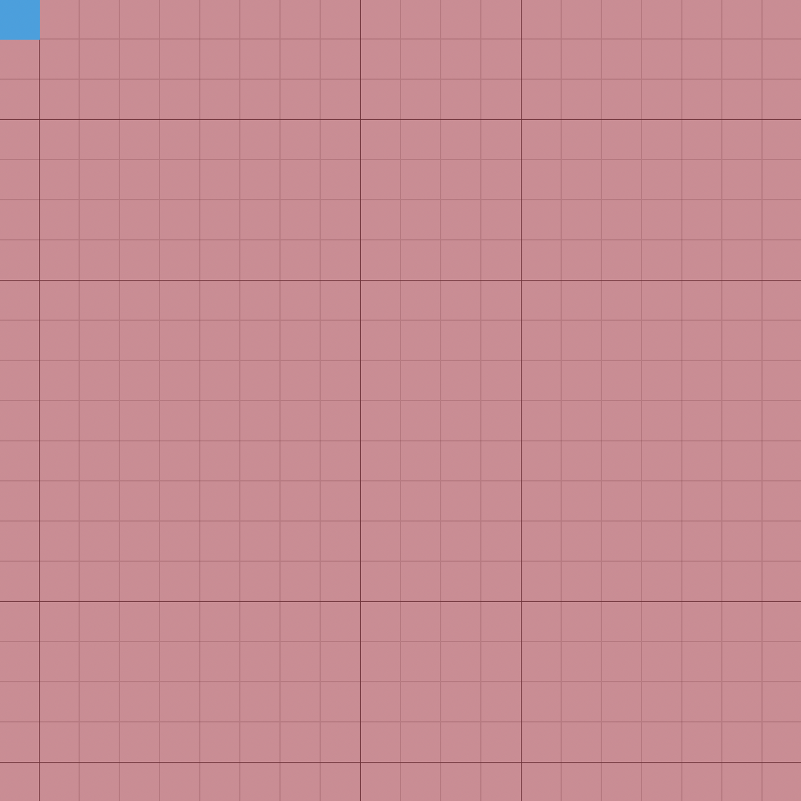

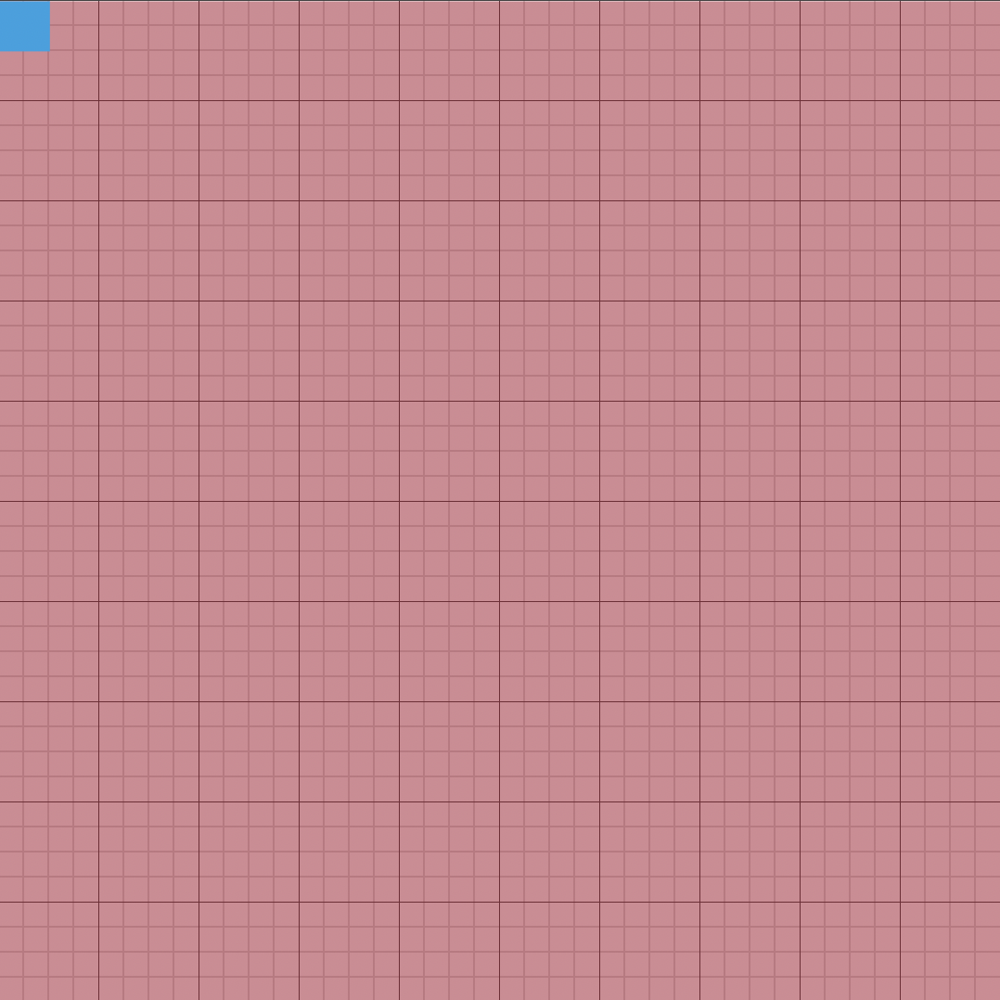

### 设备独立像素（DIP）

是一个抽象像素，用于向 CSS 中的宽度、高度、媒体查询和 meta 的 viewport 中的 device-width 提供信息。通过观察 retina（视觉屏幕） 和 非 retina 设备之间的区别，可以最好地解释它们。

可以认为设备独立像素是计算机坐标系统中得一个点，这个点代表一个可以由程序控制的虚拟像素(比如 CSS 像素)，然后由相关系统转换为物理像素。

所以说，物理像素和设备独立像素之间存在着一定的对应关系，这就是接下来要说的设备像素比。

### 设备像素比（devicePixelRatio 简称 dpr）

设备像素比定义了物理像素和设备独立像素的对应关系，它的值可以按如下的公式的得到：

* 设备像素比 = 物理像素（原图像素） / 设备独立像素（样式像素） // 在某一方向上，x方向或者y方向
* 物理像素（原图像素） =  设备独立像素（样式像素） * 设备像素比

> 当是普通屏幕时  物理像素 等于 设备独立像素
> 如果是 Retina 屏幕时，因为存在设备像素比，所以如果还想要等式成立，则必须降低 设备独立像素（样式像素）或者提升 物理像素（原图像素），我们一般不会去修改绘制图像的 CSS 宽高也就是样式像素，所以最好的做法就是提升 物理像素的大小

在浏览器中，可以通过属性window.devicePixelRatio来获取设备像素比的值。需要注意的是，浏览器本身的缩放功能也会影响这个值。比如chrome下，点击自定义按钮，可以看到浏览器的缩放比例。

不过需要注意的是，这个值的改变不会触发任何回调函数或者其他的事件监听

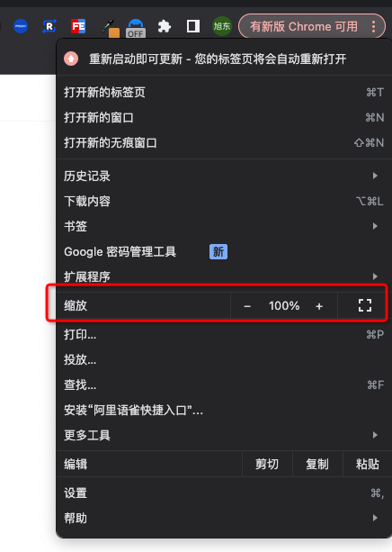

### 设备像素比对 canvas 的影响

为了对比出设备像素比对 canvas 的影响，我们需要使用 Retina（高清屏）的电脑，也就是 devicePixelRatio 的默认值（浏览器不缩放的情况）大于 1，一般来说Retina（高清屏）电脑的 devicePixelRatio 值为 2 或者 4，这里我们是 2。

**首先大家跟着我先初始化一个canvas**

``` html
<!DOCTYPE html>
<html lang="en">
<head>
  <meta charset="UTF-8">
  <meta name="viewport" content="width=device-width, initial-scale=1.0">
  <title>Canvas</title>
</head>

<body>
  <canvas id="canvas"></canvas>
</body>
<style>
  html {
    height: 100%;
  }

  body {
    margin: 0;
    padding: 0;
    height: 100%;
    display: flex;
    align-items: center;
    justify-content: center;
  }
</style>
<script>
  const canvasDom = document.getElementById('canvas');
  const ctx = canvasDom.getContext('2d');

  // 初始化 canvas 尺寸
  const initCanvas = (canvasWidth, canvasHeight) => {
    // 画布尺寸
    canvasDom.width = canvasWidth;
    canvasDom.height = canvasHeight;

    // canvas CSS尺寸
    canvasDom.style.width = `${canvasWidth}px`;
    canvasDom.style.height = `${canvasHeight}px`;
  };

  const drawCanvas = async () => {
    initCanvas(300, 300);

    ctx.beginPath();
    ctx.arc(150, 150, 100, 0, Math.PI * 2);
    ctx.lineWidth = 1;
    ctx.stroke();
  };

  drawCanvas();
</script>
</html>
```

绘制效果如下

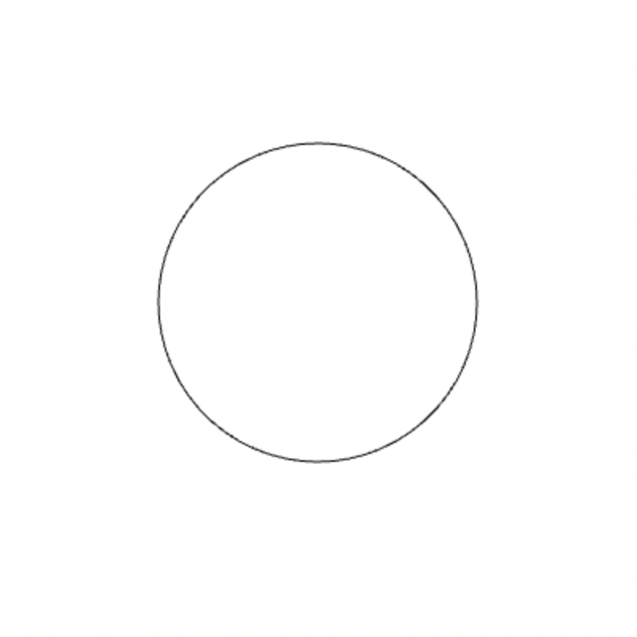

从图中可以看出，绘制的圆形有比较严重的锯齿。这是因为，当我们用 canvas 绘制的时候，使用的是设备独立像素，而最终呈现到电脑屏幕上的时候，系统会自动转换为物理像素。在一般屏幕下面，设备独立像素和物理像素一样；而在高清屏下面，一个设备独立像素可能会对应多个物理像素，这就会导致像素信息不够，由于单个像素不能分割，所以只能就近取色，从而导致图形模糊，出现锯齿。

那应该如何解决？

首先，我们了解一个概念，就是 canvas 有两个尺寸。一个是元素本身的大小（CSS 尺寸），一个是画布的尺寸。

默认情况下，当我们设置一个 cavnas 的 width 和 height 属性的时候，会同时修改元素本身的尺寸和画布的尺寸；而当用 CSS 设置元素的大小时，则只会修改元素本身的大小。

因此，在高清屏下，我们可以保持 canvas 的元素本身尺寸不变，而放大 canvas 的画布尺寸，放大的倍数是devicePixelRatio 的值。同时由于 canvas 的画布尺寸被放大，而元素本身尺寸不变，导致我们绘制的图形的尺寸会变小，此时我们可以使用画布的 scale 函数，再把图形大小还原。

如果你觉得上述概念不好理解。你可以认为 cavnas 上面也有两套像素。canvas 元素本身的像素相当于设备独立像素，而 canvas 画布的像素相当于物理像素。 假设 devicePixelRatio 为2，canvas 元素的尺寸为 300 * 300，而其画布的尺寸为 600 * 600。此时相当于画布的像素数量为 600 * 600，比原本增加了一倍。同时，每个像素的尺寸（相邻两个像素之间的间距）会减少一半，因此绘制的图形尺寸会变小，所以需要使用画布的 scale 函数来放大图形。由于画布的像素的数量和物理像素数量一样， 所以映射到屏幕（物理像素）的时候，不需要分割像素，因此不会出现模糊锯齿现象。

**所以我们对代码做一些修改**

``` js
const canvasDom = document.getElementById('canvas');
const ctx = canvasDom.getContext('2d');
const dpr = window.devicePixelRatio || 1;

const initCanvas = (canvasWidth, canvasHeight) => {
  canvasDom.width = canvasWidth * dpr;
  canvasDom.height = canvasHeight * dpr;

  canvasDom.style.width = `${canvasWidth}px`;
  canvasDom.style.height = `${canvasHeight}px`;

  ctx.scale(dpr, dpr);
};

const drawCanvas = async () => {
  initCanvas(300, 300);

  ctx.beginPath();
  ctx.arc(150, 150, 100, 0, Math.PI * 2);
  ctx.lineWidth = 1;
  ctx.stroke();
};

drawCanvas();
```

绘制效果如下，可以发现锯齿感消失了

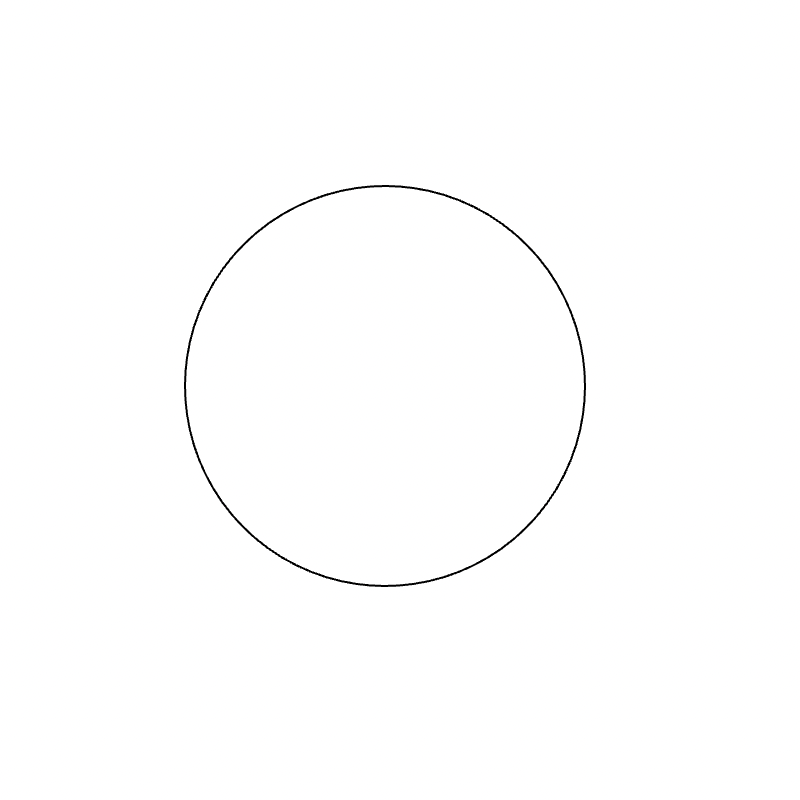

## 1px 问题

我们在了解了像素的一些基本情况下，来看看 1 像素这个经典问题，当我们绘制一条 1px 宽的线条的时候，如果线条是水平或者垂直的时候，该线条的实际宽度变宽了，同时颜色也变淡了。

还是刚才的 canvas 代码，我们简单修改一下绘制图形，代码如下：

``` js
const initCanvas = (canvasWidth, canvasHeight) => {
    canvasDom.width = canvasWidth;
    canvasDom.height = canvasHeight;

    canvasDom.style.width = `${canvasWidth}px`;
    canvasDom.style.height = `${canvasHeight}px`;
  };

const drawCanvas = async () => {
  initCanvas(300, 300);

  ctx.beginPath();
  ctx.lineWidth = 1;
  ctx.moveTo(100,100);
  ctx.lineTo(100,200);
  ctx.stroke();

  ctx.beginPath();
  ctx.lineWidth = 2;
  ctx.moveTo(100,200);
  ctx.lineTo(100,300);
  ctx.stroke();
};
```

绘制效果如下：

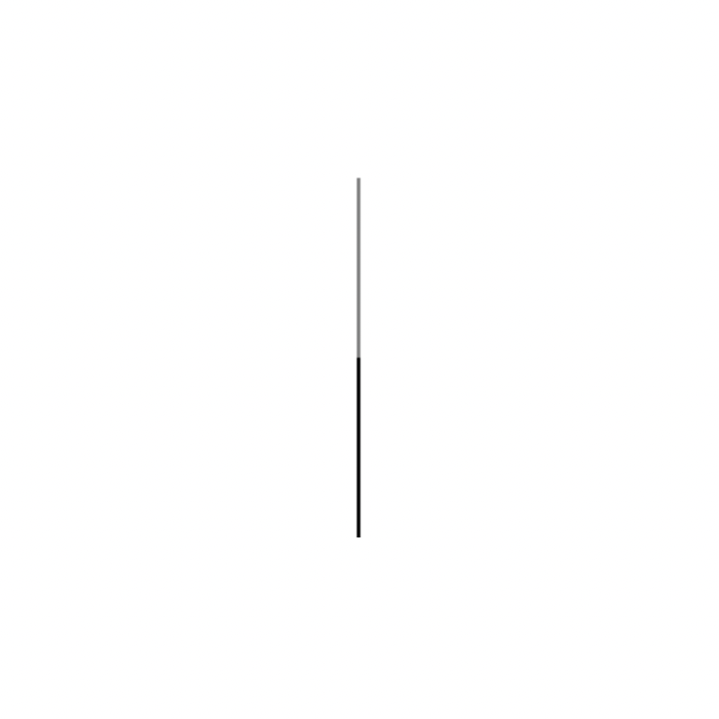

可以看出，线宽为 1 的线段看起来和线宽为 2 的线段绘制的效果一样宽，但是线宽为 1 的线段的颜色明细变淡了，看起来变得模糊了。

为何会出现这种情况呢？前面我们说过，canvas 其实是由一个一个像素组成的。我们把这些像素放大，看起来canvas 就是由如下图一样一个一个网格组成的，每个网格代表一个像素：

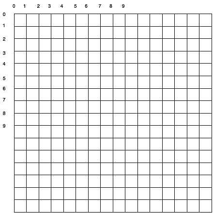

在下图中，填充了 (2,1) 至 (5,5) 的矩形，整个区域的边界刚好落在像素边缘上，这样就可以得到的矩形有着清晰的边缘。

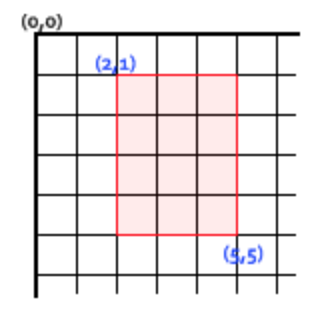

当我们绘制线段的时候，会有一个起始点 S 和终止点 E，事实上，canvas 绘制的每条线段都有一条无限细的中线，线段的宽度是从中线向两侧延伸的，S 和 E 点都在线段的中线上，如下图所示：

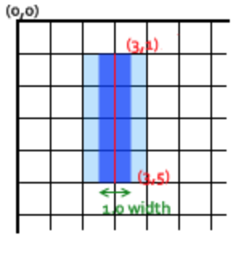

线段从起点（3，1），绘制到终点（3，5），由于线段的宽度是从中线向两侧延伸的，所以绘制线段会占据图中红色线条左右各一半的位置。由于线宽只有 1px，所以左边的一半是 0.5px，右边的一半也是 0.5px。 但是计算机是不能绘制半个像素，因此左右的半个像素都会被扩展到 1 个像素，也就是图中的深蓝色区域会被扩展到浅蓝色区域。

也就是说 canvas 做了一个折中的事：把左右两个像素都绘制了，同时 canvas 也对绘制颜色做了折中，把原本颜色的色调调到原本的一半。结果就是以实际笔触颜色一半色调的颜色来填充整个区域（浅蓝和深蓝的部分）。

那么应该如何解决这个问题呢？既然线段的起点和终点都在线段的中线上面，对于 1px 线宽的线段，当起点和终点在某个像素中间位置的时候，由于线段会左右各延展 0.5px，此时正好占据整个像素。如下图所示：

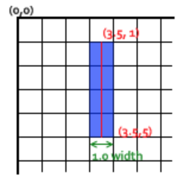

上图中，线段的起点为（3.5，1），终点为（3.5，5）线段会绘制线段会占据图中红色线条左右各一半的位置，正好是一个完整像素的左右一半。因此，线段会占据一个完整的像素，其边缘正好落在像素边界，填充出来就是准确的宽为 1 的线段。

如果思考一下，我们就可以得出结论？ 不只是 1px 宽度的线段会出现上述问题。

对于线宽是奇数的线段，也会出现一样的问题。比如以下代码：

``` js
const drawCanvas = async () => {
  initCanvas(300, 300);

  ctx.beginPath();
  ctx.lineWidth = 3;
  ctx.moveTo(100,100);
  ctx.lineTo(100,200);
  ctx.stroke();
  
  ctx.beginPath();
  ctx.lineWidth = 4;
  ctx.moveTo(100,200);
  ctx.lineTo(100,300);
  ctx.stroke();
};
```

绘制效果如下：

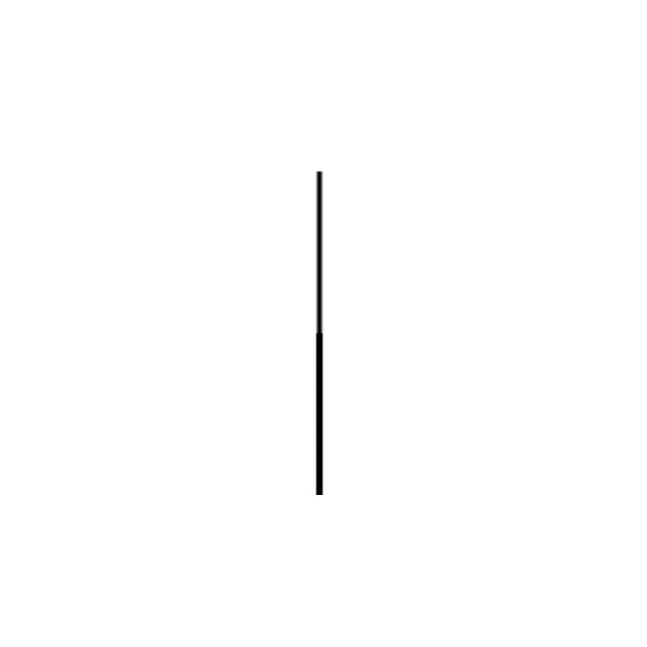

首先，绘制线宽为 3 的线段，起点为（100，100），终点为（100，200）；

然后，绘制线宽为 4 的线段，起点为（100，200），终点为（100，300）；

从图中可以看出，线宽为 3 的线段和线宽为 4 的线段，最终绘制的宽度都是 4。只是线宽为 3 的线段的边缘变得模糊。

道理和前面解释 1px 的一样。如下图：

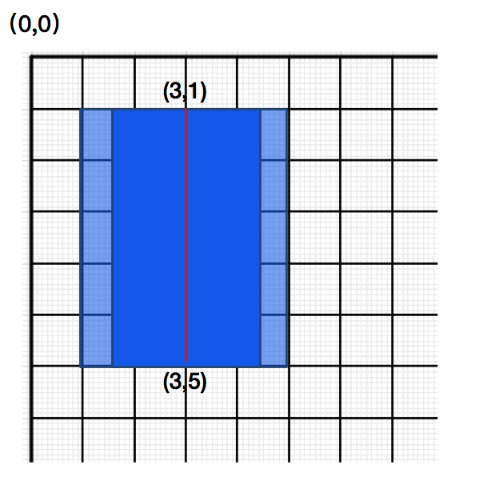

假设起点在（3，1）的位置，由于起点在线段的中线上面，所以线段会向左右各延伸线宽的一半，也就是 1.5，这样左右都会占一个完整的像素+ 半个像素，左右两边完整的那个像素会按照正常绘制，而半个像素会按照半色调填充对应的的整个像素；因此会绘制两个像素的全色（最靠近红线），和两个像素的半色（离红线比较远的），最终的效果就是线段的中间部分是实际颜色填充，而边缘的两个像素会比较模糊。

因此我们可以得出如下结论（假设原始的起点坐标和终点坐标都是整数）

* 当线宽为奇数的时候，如果线段是垂直的，绘制的时候，起点和终点的 x 坐标应该减去 0.5
* 当线宽为奇数的时候，如果线段是水平的，绘制的时候，起点和终点的 y 坐标应该减去 0.5
* 当线宽为偶数的时候，不需要偏移坐标
