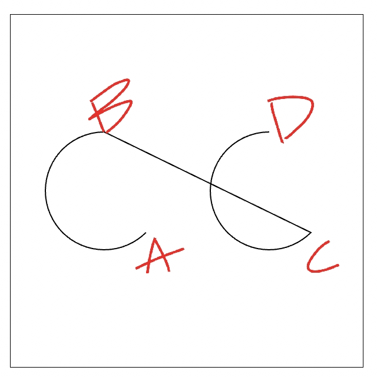
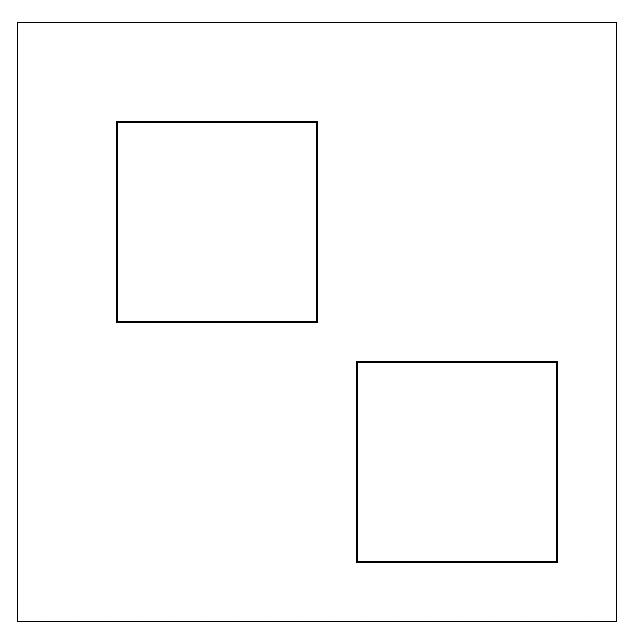

# 深入的理解路径

## 路径、子路径的概念

在 canvas 对象中，存在一个路径的概念。一条路径包含了零条或者多条子路径。而每一条子路径包含了一个或者多个点，这些点之间用直线或者曲线连接起来。子路径上面有一个标记，表示子路径是闭合还是不闭合，一条闭合的子路径，其最后一个点和第一个点会通过直线连接起来。

在绘制路径的时候，会遍历路径包含的所有子路径，然后绘制每一条子路径。

当一条子路径包含的点少于两个的时候，该子路径在绘制的时候就会被自动忽略掉。

## 当前路径

在任何时刻，canvas 之中只能有一条路径存在，canvas 规范将其称为“当前路径”（current path）。在 canvas 被创建的时候，当前路径总是被初始化为包含零条子路径。

在使用 stroke 或者 fill 函数（不带参数），通过路径绘制线条或者形状的时候，总是会使用当前路径来进行绘制。以下函数会把相关的子路径添加到当前路径：

* context.moveTo(x, y)

  使用给定的点 (x, y) 创建一条新的子路径，并把子路径添加到当前路径，新创建的子路径为当前子路径。
* context.lineTo(x, y)

  添加指定点 (x, y) 到当前子路径，该点和前一个点通过直线连接。
* context.quadraticCurveTo(cpx, cpy, x, y)

  添加指定点 (x, y) 到当前子路径，该点和前一个点通过指定控制点 (cpx, cpy) 控制的二次贝塞尔曲线连接起来。
* context.bezierCurveTo(cp1x, cp1y, cp2x, cp2y, x, y)

  添加指定点 (x, y) 到当前子路径，该点和前一个点通过指定控制点 (cp1x, cp1y) 和 (cp2x, cp2y) 控制的三次贝塞尔曲线连接起来。
* context.arcTo(x1, y1, x2, y2, radius)

  添加由指定控制点和半径控制的弧线到当前子路径，该弧线和前一个点通过直线连接。如果半径 radius 被指定为负数，会抛出异常。
* context.arc(x, y, radius, startAngle, endAngle [, counterclockwise ] )

  添加圆弧的两个端点到子路径，两个端点通过圆弧连接。圆弧由参数所描述，从 startAngle 开始，到 enAngle 结束，走向由指定方向决定（默认是 clockwise ),该弧线和前一个点通过直线连接。如果半径radius被指定为负数，会抛出异常。
* context.rect(x, y, w, h)

  添加一段新的闭合的子路径到当前路径，子路径是一个矩形。
* context.closePath()

  标记当前子路径为闭合，并开始一段新的子路径，子路径包含一个点（这个点就是结束子路径的结束点），该点是新标记为闭合的子路径的起始点和结束点(位置为一个点)。

## 重置当前路径（beginPath）

前面学习了路径、子路径、当前路径的概念。canvas 是基于状态的，什么意思呢？就是在当前路径上面添加的所有子路径，会被一直保存下来，直到调用绘制 API 。

因此在使用路径进行绘制的时候，就需要注意一个问题：

在绘制完一条路径之后，要绘制另外一条路径时，就需要重置当前路径。比如下面的示例代码：

``` js
ctx.rect(20, 20, 100, 100);
ctx.fillStyle = 'red';
ctx.fill();
ctx.rect(120, 120, 100, 100);
ctx.fillStyle = 'blue';
ctx.fill();
```

上述代码中，我们希望得到一个红色的矩形和一个蓝色的矩形，比如下图：


但是我们得到的却是这样的：


为什么会这样？ 结合前面的路径、子路径和当前路径的知识，就很容易解释这个问题？

代码开始的时候，当前路径包含零条子路径，然后执行 ctx.rect(20, 20, 100, 100) 这行代码，往当前路径中添加了一条矩形子路径。 设置 fillStyle 为红色，然后填充 fill()，此时绘制一个红色的矩形，通过断点可以看到效果：


再之后，执行 ctx.rect(120, 120, 100, 100)  往当前路径添加另外一条矩形子路径。此时当前路径包含两条子路径。设置 fillStyle 为蓝色，然后填充 fill()，由于当前路径包含两条子路径，此时绘制两个蓝色的矩形，通过断点可以看到效果，第一个红色矩形会被蓝色矩形覆盖。效果参考上面的图形。

那么上述代码要如何得到预期的效果呢？ 只要在添加第二条矩形子路径之前，重置下当前路径即可。重置当前路径的函数是 beginPath:

  **context.beginPath 重置当前路径（Resets the current path）**

因此上面的代码可以修改为：

``` js
ctx.rect(20, 20, 100, 100);
ctx.fillStyle = 'red';
ctx.fill();

ctx.beginPath();

ctx.rect(120, 120, 100, 100);
ctx.fillStyle = 'blue';
ctx.fill();
```

修改之后的代码可以得到正确的结果，参考下图：


一个重要的原则，每次使用路径绘制线条或形状的时候, 都应该调用 ctx.beginPath() 重置当前路径，特别是在封装一些绘图的组件或者绘制复杂的大场景的时候，遵循这个原则可以避免很多不必要的麻烦，让代码更加健壮。

有一点需要注意为什么我在绘制图形的没有用到 strokeRect() 或者 fillRect() 呢？这样写不是会省略部分代码吗？

> 其实在原生 api 中 strokeRect() 或者 fillRect() 已经帮助我们优化这些坏习惯，这些 API 每次调用会触发 ctx.beginPath()。
> 至于我们所熟悉的 ctx.save() 和 ctx.restore() 为什么不生效，后面我们会讲到。

## arc、arcTo、rect的相关问题

### 多个 arc 的情况

下面的代码，会绘制两个圆：

``` js
ctx.beginPath();
ctx.arc(80, 150, 50, 0, Math.PI * 2);
ctx.arc(220, 150, 50, 0, Math.PI * 2);
ctx.stroke();
```

最终会显示出这样的图案：


可能会感到奇怪，为什么在两个圆形之间会有一条直线连接。让我们回到 arc 函数的定义：


可以看出，调用 arc 函数，相当于在当前子路径增加两个点，而这两个点之间用圆弧连接。我们试着调整上述代码，不画一整个圆，就更容易理解这个问题：

``` js
ctx.beginPath();
ctx.arc(80, 150, 50, Math.PI / 4, 3 * Math.PI / 2);
ctx.arc(220, 150, 50, Math.PI / 4, 3 * Math.PI / 2);
ctx.stroke();
```

如图所示：


添加第一个圆弧的时候，会在当前子路径添加两个点 A 和 B ，A 和 B 之间使用圆弧连接。添加第二个圆弧的时候，会在当前子路径中添加点 C 和 D 。由于此时当前子路径已经有了 A 和 B 点，所以 C 点会和前一个点 B 点连接起来，如下图所示：



知道了两条圆弧之间（只要是在当前路径的同一条子路径）会有连接线的原因，如果要去掉连接线应该如何处理呢？回头看前面的知识，moveTo 方法会创建一条新的子路径。因此可以在第二次调用 arc 方法前先调用 moveTo 方法，并且 moveTo 的位置正好应该是第二条圆弧的第一个点（前面示例中的C点），比如如下代码：


``` js
ctx.beginPath();
ctx.arc(80, 150, 50, 0, Math.PI * 2);
ctx.moveTo(270,150);
ctx.arc(220, 150, 50, 0, Math.PI * 2);
ctx.stroke();
```

效果如图所示：


以上代码的缺点是，moveTo 的坐标点需要计算，并不直观。

当然还有另外一个处理方法就是，调用两次 beginPath 和 stroke 方法。比如如下代码：

``` js
ctx.beginPath();
ctx.arc(80, 150, 50, 0, Math.PI * 2);
ctx.stroke();

ctx.beginPath();
ctx.arc(220, 150, 50, 0, Math.PI * 2);
ctx.stroke();
```

绘制的效果如上图所示。 这种方法的好处是代码逻辑清晰，每次相当于都重新重置当前路径并绘制。 然而在一些特殊的情况下，可能不会采用当前方法，比如希望批量绘制来优化绘制效率的时候，以后我们讲解优化绘制效率的时候会讲到。

### 多个 rect 的情况

如果是连续调用两次 rect 函数，情况又是如何呢？

``` js
ctx.beginPath();
ctx.rect(50, 50, 100, 100);
ctx.rect(170, 170, 100, 100);
ctx.stroke();
```

如图所示：


可以看出，两个矩形之间并不会像两个圆形之间一样，中间会有一条连接的直线。 其实通过查看 rect 函数的定义，很容易找到答案, 因为 rect 函数总是会添加新的子路径：


不过我们需要注意的一点是，既然是闭合子路径那么，结束点和起始点是一样都是 （x, y），所以在创建新的子路径（moevTo）或者重置当前路径（beginPath）之前，绘制的子路径都会连接这个点。

### arcTo 详解

ctx.arc 函数的是在指定的坐标 (x, y) 绘制半径为 radius 的圆弧，相当于指定中心点和半径来确定圆弧。 而 arcTo() 方法则使用切点和一个半径，来为当前子路径添加一条圆弧。arcTo 函数接收 5 个参数，分别是两个切点的坐标和圆弧半径。该方法是依据切线画弧线，即由两条切线和半径确定一条弧线。 函数：context.arcTo(x1, y1, x2, y2, radius);

圆弧的起点与当前子路径的最后一个点到 (x1,  y1) 点的直线相切，圆弧的终点与 (x1,  y1) 点到 (x2,  y2) 的直线相切。因此其通常配合 moveTo() 或 lineTo() 使用。此函数在某些时候使用比 arc 函数方便，比如绘制圆角的矩形：

``` js
ctx.beginPath();
// 上边
ctx.moveTo(120, 100);
ctx.lineTo(180, 100);

// 右上角
ctx.arcTo(200, 100, 200, 120, 20);

// 右边
ctx.lineTo(200, 180);

// 右下角
ctx.arcTo(200, 200, 180, 200, 20);

// 下边
ctx.lineTo(120, 200);

// 左下角
ctx.arcTo(100, 200, 100, 180, 20);

// 左边
ctx.lineTo(100, 120);

// 左上角
ctx.arcTo(100, 100, 120, 100, 20);
ctx.stroke();
```

如图所示：


> 需要注意的是使用 arcTo 的时候和 arc 有同样的问题，arcTo 和 arc 一样不会创建新的子路径。

## ctx.closePath

ctx.closePath 会把当前的路径标记为关闭的，并且从当前子路径的开始点开始一条新的子路径。

下面代码展示了 closePath 的使用：

``` js
ctx.lineWidth = 10;

ctx.beginPath();
ctx.moveTo(100, 100);
ctx.lineTo(200, 100);
ctx.lineTo(200, 200);
ctx.closePath();
ctx.stroke();
```

如图所示：


需要注意的是，闭合路径和直接使用 lineTo 闭合的方式，在连接处是有差别的，比如如下代码：

``` js
ctx.lineWidth = 10;

ctx.beginPath();
ctx.moveTo(100, 100);
ctx.lineTo(200, 100);
ctx.lineTo(200, 200);
ctx.lineTo(100, 100);
ctx.stroke();
```

连接处的差异如下（差别在于闭合处的衔接方式不一样）：


> 我们知道路径与端点的连接点也是有属性可控制的，lineCap
> * butt  默认，向线条的每个末端添加平直的边缘
> * round  向线条的每个末端添加圆形线帽
> * square  向线条的每个末端添加正方形线帽

如果是 lineTo 闭合我们可以试试这个属性：

``` js
ctx.lineWidth = 10;
ctx.lineCap = 'round';

ctx.beginPath();
ctx.moveTo(100, 100);
ctx.lineTo(200, 100);
ctx.lineTo(200, 200);
ctx.lineTo(100, 100);
ctx.stroke();
```


可以发现连接处有了变化。

## path2D

Path2D 是一个实验性质的功能，不过目前大部分浏览器也支持这个功能。前面说到了路径的概念，Path2d 其实就是路径抽象出来的一个类。在 Path2D 对象上面，可以调用前面提到的路径相关的方法，创建路径并把路径存储在 Path2D 对象。前文所说的当前路径，可以类比为一个默认的 Path2D 对象。

### 构造函数

构造函数 Path2D() 会返回一个新初始化的 Path2D 对象，（可以将某一个路径作为变量——创建一个它的副本，或者将一个包含 SVG path 数据的字符串作为变量）：

``` js
new Path2D();     // 初始化一个空的 Path2D 对象
new Path2D(path); // 克隆一个 Path2D对象
new Path2D(d);    // 从SVG路径建立Path2D对象
```

### Path2D对象的函数

打印看下：


上面的方法，除了 addPath 函数外，其他方法，前面都有讲过，只是函数的主体转到了 Path2D 对象上，函数的具体内容基本没啥差别。Path2D 负责构造路径，真正绘制还是要使用 stroke 和 fill 函数。要使用 Path2D 绘制路径或者形状，只需要把 Path2D 对象作为参数传递给 stroke 或 fill 函数即可：

``` js
const path2d = new Path2D();
path2d.rect(100, 100, 100, 100);
ctx.stroke(path2d);
```

最终效果如下：


上面还介绍过，Path2D 的支持 SVG 路径的构造函数，下面是示例代码：

``` js
const path2d = new Path2D('M100 100 h 180 v 180 h -180 Z');
ctx.stroke(path2d);
```

如图所示：


### Path2D和默认路径比较

可以看出 Path2D 能达到的效果，canvas 的默认的路径绘制功能也可以达到。那么 Path2D 的作用是什么呢？ 总结下来 Path2D 有以下用处：

* 可以存储路径

  默认的路径绘制，在调用 beginPath 的时候，当前路径会被清空。如果想要再次绘制相同的路径，必须在重新来一遍。而使用 Path2D 对象后，可以存储绘制路径，用来复用，以此来简化绘制代码。
* 提高运行速度

  用默认的路径绘制，在每次调用 beginPath 和调用路径相关方法，都会有性能消耗。而如果用 Path2D 存储之后，绘制的时候可以减少性能消耗，提高运行速度。
* 可以使用 svg 的 path 语法来构造路径

### Path2D不影响默认当前路径

在使用 Path2D 绘制路径的时候，Path2D 的路径不会影响默认路径绘制中的当前路径。比如下面的代码：

``` js
ctx.beginPath();
ctx.moveTo(100,100);
const path2d = new Path2D();
path2d.rect(100,100,100,100);
ctx.stroke(path2d);
ctx.lineTo(300,300);
ctx.stroke();
```

效果如下：


上面代码中，先调用 moveTo 方法，然后创建一个 Path2D 对象，并在 Path2D 对象上面添加一个矩形路径并调用 ctx.stroke(path2d) 方法绘制一个矩形。之后再调用 lineTo 方法，在调用 stroke 方法。结果如下，可以看出默认路径仍然是一条直线。

### 可以使用Path2D的方法

* ctx.fill(path)
* ctx.stroke(path)
* ctx.clip(path)
* ctx.isPointInPath(path)
* ctx.isPointInStroke(path)

能看到两个新的 API（isPointInPath、isPointInStroke），这两个 API 是新增加的方法，我们后面再来介绍。

## 路径方向和非零环绕原则

### 路径方向

在前面介绍的 arc 函数，其最后一个可选参数 counterclockwise 表示路径的方向；方向有顺时针方向和逆时针方向两种。比如下面的代码分别绘制一个顺时针和逆时针的半圆:

``` js
ctx.beginPath();
ctx.arc(70, 100, 50, 0, Math.PI, false);
ctx.stroke();

ctx.beginPath();
ctx.arc(220, 100, 50, 0, Math.PI, true);
ctx.stroke();
```

效果如下：


arc 函数有顺时针和逆时针两种方向，rect 函数则只有顺时针一种方向。如果要使用逆时针方向的 rect，则需要开发者自己通过 moveTo 和 lineTo 来模拟。比如下面的代码：

``` js
const oldRect = CanvasRenderingContext2D.prototype.rect;

CanvasRenderingContext2D.prototype.rect = function(x, y, width, height, counterclockwise) {
  const ctx = this;
  
  if(!counterclockwise) {
  	oldRect.call(ctx, x, y, width, height);
  } else {
   ctx.moveTo(x,y);
   ctx.lineTo(x, y + height);
   ctx.lineTo(x + width, y + height);
   ctx.lineTo(x + width,y);
   ctx.closePath();
  };

  return ctx;
}
```

实验一下：

``` js
ctx.beginPath();
ctx.rect(50, 50, 100, 100);
ctx.rect(170, 170, 100, 100, true);
ctx.stroke();
```

效果如下：



其实单个 rect 顺时针和逆时针并没有差别，差别在后面会说明（目前可以通过打断点的方式来判断）。

上面说明了arc rect 的路径的时针方向。同时通过 moveTo、lineTo 方法指定路径的时候，开发者可以自己灵活的指定方向（参考上面 rect 函数的模拟）。

为什么路径的方向很重要，那是因为其和我们下面要讲的非零环绕原则有关。

### 非零环绕规则

使用 fill 函数填充路径的时候，如果路径是圆形、矩形之类的，是比较简单的情形。 但是当路径存在循环或者自相交的情况，则会变得比较复杂。比如下面的路径，当使用 fill 的时候，应该是哪些区域被填充呢？

``` js
ctx.beginPath();
ctx.moveTo(100,100);
ctx.quadraticCurveTo(200, 100, 200, 200);
ctx.quadraticCurveTo(150, 150, 250, 50);
ctx.quadraticCurveTo(200, 400, 100, 100);
ctx.quadraticCurveTo(200, 500, 250, 50);
ctx.stroke();
```

效果如下：


路径方向如下：


事实上，canvas 在填充交叉的路径的时候，有一个计算规则来确定哪些区域应该被填充，该规则就是非零环绕规则。

**计算方法如下：**

对于路径中的任意区域，从该区域中的任一点引出一条线段，该线段足够长以保证线段的另外一点能够完全落在路径围绕的区域之外，如下图所示：


接下下统计线段与路径的相交情况，首先把计数器初始化为 0，然后当线段与顺时针方向的路径相交时，计数器加 1，当线条与逆时针方向的路径相交时，计数器减1。如果最终计数器的值为非零， 则表示该区域在路径里面，此时调用 fill 函数时候，该区域会被填充；如果为零，则该区域不在路径里面，该区域不会被填充。

使用上面的规则，最终上面复杂路径的填充绘制效果如下：

``` js
ctx.beginPath();
ctx.moveTo(100,100);
ctx.quadraticCurveTo(200, 100, 200, 200);
ctx.quadraticCurveTo(150, 150, 250, 50);
ctx.quadraticCurveTo(200, 400, 100, 100);
ctx.quadraticCurveTo(200, 500, 250, 50);
ctx.fillStyle = 'red';
ctx.fill();
```


### 非零环绕规则的应用

运用非零环绕规则可以实现圆环效果，剪纸效果等。

#### 绘制圆环

如下代码：

``` js
ctx.beginPath();
ctx.arc(150, 150, 90, 0, Math.PI * 2);
ctx.arc(150, 150, 100, 0, Math.PI * 2, true);
ctx.fill();
```

效果如下：


> 提问，如果两个圆都是顺时针或者逆时针，填充时会发生什么？

#### 剪纸镂空效果

可以先用顺时针绘制一个大的矩形区域，然后在该区域上面添加逆时针方向的路径，实现镂空效果, 示例代码如下:

``` js
// 三角形（逆时针）
function drawPathTriangle(ctx, x1, y1, x2, y2, x3, y3, counterclockwise) {
  ctx.moveTo(x1, y1);

  if (!counterclockwise) {
    ctx.lineTo(x2, y2);
    ctx.lineTo(x3, y3);
  } else {
    ctx.lineTo(x3, y3);
    ctx.lineTo(x2, y2);
  };

  ctx.lineTo(x1, y1);
};

ctx.beginPath();
ctx.rect(10, 10, 280, 280);

// 逆时针矩形路径
ctx.rect(30, 30, 240, 110, true);

//逆时针三角形路径
drawPathTriangle(ctx, 70, 200, 100, 250, 40, 250, true);

ctx.arc(220, 225, 30, 0, Math.PI * 2, true);

ctx.closePath();
ctx.fillStyle = "#872245";
ctx.fill();
```

效果如下：


