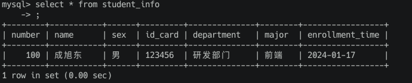
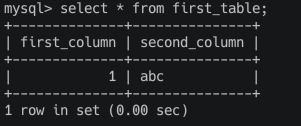
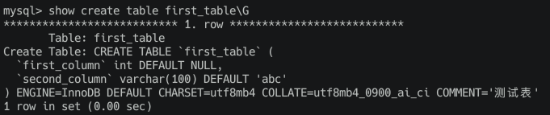
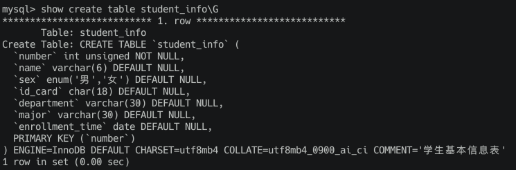
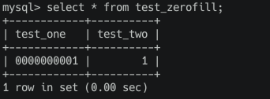
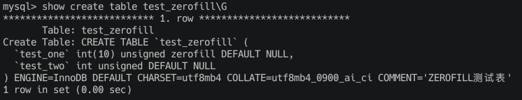
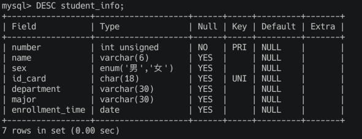

# 列属性

介绍列的属性之前，我们应该先稍微了解一点查询表中的记录和向表中插入记录的简单语句。

## 简单的查询和插入的语句

### 简单的查询语句

如果我们想查看某个表里已经存储了哪些数据，可以用下边这个语句：

``` shell
SELECT * FROM 表名
```

### 简单的插入语句

MySQL 插入数据的时候是以行为单位的，语法格式如下：

``` shell
INSERT INTO 表名 (列1, 列2, ...) VALUES (值1, 值2, ...);
```

也就是说我们可以在表名后边的括号中指定要插入数据的列，然后在 VALUES 后边的括号中按指定的列顺序填入对应的值，我们来为 student_info 表插入一行数据

``` shell
INSERT INTO student_info (number, name, sex, id_card, department, major, enrollment_time) VALUES (100, '成旭东', '男', '123456', '研发部门', '前端', CURDATE());
```

插入完成后我们来用上面的查询语句，查询看下：



第一行数据就插入成功了！

### 批量插入

每插入一行数据写一条语句也不是不行，但是对人来说太烦了，而且每插入一行数据就向服务器提交一个请求远没有一次把所有插入的数据提交给服务器效率高，所以 MySQL 为我们提供了批量插入记录的语句：

``` shell
INSERT INTO 表名 (列1, 列2, ...) VAULES (列1的值, 列2的值, ...), (列1的值，列2的值, ...), (列1的值，列2的值, ...), ...;
```

## 列的属性

### 默认值

列的默认值为 NULL，NULL 的含义是这个列的值还没有被设置。如果我们不想让默认值为 NULL，而是设置成某个有意义的值，可以在定义列的时候给该列增加一个 DEFAULT 属性，就像这样：

``` shell
列名 列的类型 DEFAULT 默认值
```

比如我们把 first_table 的 second_column 列的默认值指定为 'abc'，创建一下这个表：

``` shell
CREATE TABLE first_table(
  first_column INT,
  second_column VARCHAR(100) DEFAULT 'abc'
) COMMENT '测试表';
```

然后我们插入一条数据看看默认值是否有了：

``` shell
INSERT INTO first_table (first_column) VALUES (1);
```



可以看到默认值添加成功了！对于 first_column 来说没有设置默认值，那通过表结构可以看到默认值为 NULL



### NOT NULL 属性（非空值）

有时候我们需要要求表中的某些列中必须有值，不能存放 NULL，那么可以用这样的语法来定义这个列：

``` shell
列名 列的类型 NOT NULL
```

比如我们把 first_table 表的 first_column 列定义一个 NOT NULL属性。我们通过之前说的修改列信息的方式修改：

``` shell
ALTER TABLE first_table MODIFY COLUMN first_column INT NOT NULL;
```

**不过我们在将 first_column 的列属性修改为 NOT NULL 之前，要确认表中没有 first_column 为 NULL 的数据**

可以通过查询来确认

``` shell
SELECT * FROM first_table WHERE first_column IS NULL;
```

如果有返回的数据，就需要修改这行数据的 first_column 值，不过我们目前还没有说如何修改行的数据，所以我们只能删掉这些数据（测试的表，删除无所谓，在业务中可不行奥）

``` shell
DELETE FROM first_table WHERE first_column IS NULL;
```

之后在修改列信息就可以了。

另外，一旦对某个列定义了 NOT NULL 属性，那这个列的默认值就不为 NULL 了。意味着我们在使用 INSERT 插入行时必须显式的指定这个列的值，而不能省略它。

### 主键

> 有时候在我们的表里可以通过某个列或者某些列确定唯一的一条记录，我们就可以把这个列或者这些列称为候选键。比如在学生信息表 student_info 中，只要我们知道某个学生的**学号**，就可以确定一个唯一的学生信息，也就是一条记录。当然，我们也可以通过**身份证号**来确定唯一的一条学生信息记录，所以**学号和身份证号都可以作为学生信息表的候选键**。在学生成绩表 student_score 中，我们可以通过**学号和科目**这两个列的组合来确定唯一的一条成绩记录，所以**学号、科目这两个列的组合可以作为学生成绩表的候选键**。

一个表可能有多个候选键，我们可以选择一个候选键作为表的主键。**一个表最多只能有一个主键**，**主键的值不能重复**，通过主键可以找到唯一的一条记录。如果我们的表中有定义主键的需求可以选用下边这两种方式之一来指定主键：

1. 如果主键只是单个列的话，可以直接在该列后声明 PRIMARY KEY，比如我们把学生信息表 student_info 的学号列声明为主键可以这么写：

``` shell
CREATE TABLE student_info (
  number INT PRIMARY KEY,
  name VARCHAR(5),
  sex ENUM('男', '女'),
  id_card CHAR(18),
  department VARCHAR(30),
  major VARCHAR(30),
  enrollment_time DATE
);
```

2. 我们也可以把主键的声明单独提取出来，用这样的形式声明：

``` shell
PRIMARY KEY (列名1, 列名2, ...)
```

使用的时候就像下面这样

``` shell
CREATE TABLE student_info (
  number INT,
  name VARCHAR(5),
  sex ENUM('男', '女'),
  id_card CHAR(18),
  department VARCHAR(30),
  major VARCHAR(30),
  enrollment_time DATE,
  PRIMARY KEY (number)
);
```

值得注意的是，对于多个列的组合作为主键的情况，必须使用这种单独声明的形式，比如 student_score 表里的学号,科目的列组合作为主键，可以这么写：

``` shell
CREATE TABLE student_score (
  number INT,
  subject VARCHAR(30),
  score TINYINT,
  PRIMARY KEY (number, subject)
);
```

主键列默认是有NOT NULL属性，也就是必填的，如果填入NULL值会报错。

我们对 student_info 这个表的 name 列做信息修改，变为主键

``` shell
ALTER TABLE student_info MODIFY COLUMN number INT UNSIGNED PRIMARY KEY;
```

修改后，查看表结构信息，我们能看到 number 变为这张表的主键了



### UNIQUE 属性

对于不是主键的其他候选键，如果也想让 MySQL 在我们向表中插入新记录的时候帮助我们校验一下某个列或者列组合的值是否重复，那么我们可以把这个列或列组合添加一个 UNIQUE 属性，表明该列或者列组合的值是不允许重复的。

与我们在建表语句中声明主键的方式类似，为某个列声明 UNIQUE 属性的方式也有两种：

1. 如果我们想为单个列声明 UNIQUE 属性，可以直接在该列后填写 UNIQUE 或者 UNIQUE KEY，比如在学生信息表 student_info 中，我们不允许两条学生基本信息记录中的身份证号是一样的，那我们可以为 id_card 列添加 UNIQUE 属性：

``` shell
CREATE TABLE student_info (
  number INT PRIMARY KEY,
  name VARCHAR(5),
  sex ENUM('男', '女'),
  id_card CHAR(18) UNIQUE,
  department VARCHAR(30),
  major VARCHAR(30),
  enrollment_time DATE
);
```

2. 我们也可以把 UNIQUE 属性的声明单独提取出来，用这样的形式声明：

``` shell
UNIQUE KEY (列名1, 列名2, ...)
```

使用的时候就像下面这样

``` shell
CREATE TABLE student_info (
  number INT,
  name VARCHAR(5),
  sex ENUM('男', '女'),
  id_card CHAR(18),
  department VARCHAR(30),
  major VARCHAR(30),
  enrollment_time DATE,
  UNIQUE KEY (number)
);
```

> 其实每当我们为某个列添加了一个 UNIQUE 属性，就像是在孙悟空头上带了个紧箍咒一样，从此我们插入的记录的该列的值就不能重复，所以为某个列添加一个 UNIQUE 属性也可以认为是为这个表添加了一个约束，我们就称之为 UNIQUE 约束。每个约束都可以有一个名字，像主键也算是一个约束，它的名字就是默认的 PRIMARY。不过一个表中可以为不同的列添加多个 UNIQUE 属性，也就是添加多个 UNIQUE 约束，每添加一个 UNIQUE 约束，我们就可以给它起个名，这也是上边的约束名称的含义。不过约束名称是被中括号[]扩起来的，意味着我们写不写都可以，如果不写的话 MySQL 自己会帮我们起名。其实就像是自己生了个孩子，如果自己不起名的话，人家公安局的警察叔叔也得给孩子起个名上户口。

为约束起名的事儿理解了之后，我们把这个 UNIQUE 属性的声明放到列定义的后边就好了。比如我们为 student_info 表的 id_card（身份证号）列添加 UNIQUE 属性也可以这么写：

``` shell
CREATE TABLE student_info (
  number INT PRIMARY KEY,
  name VARCHAR(5),
  sex ENUM('男', '女'),
  id_card CHAR(18),
  department VARCHAR(30),
  major VARCHAR(30),
  enrollment_time DATE,
  UNIQUE KEY uk_id_card (id_card)
);
```

可以看到，我们给这个UNIQUE约束起的名儿就是uk_id_card。

不过我们总不能删了表重建，所以我们还是采用**添加约束的方式**

``` shell
ALTER TABLE student_info ADD CONSTRAINT uk_id_card UNIQUE KEY(id_card);
```

#### CONSTRAINT 添加约束

在数据库系统中，CONSTRAINT 是一种用来定义表的某些规则的 SQL 关键字。约束（Constraints）用于确保数据库表中的数据满足特定的条件，从而保持数据的正确性和可靠性。在创建或修改表结构时，可以定义多种类型的约束。下面是几种常见的约束类型：

1. PRIMARY KEY：
  * 主键约束确保表中的每行都有一个唯一的标识符。一个表只能有一个主键，主键列不能包含 NULL 值。
2. FOREIGN KEY：
  * 外键约束用于确保一个表中的数据与另一个表的数据相关联。它是保持数据完整性的一种方式，确保对应的关系存在。
3. UNIQUE：
  * 唯一约束保证在一个表的某一列中，每个值都是唯一的。一个表可以有多个唯一约束。
4. CHECK：
  * 检查约束用于确保列中的值满足特定的条件。例如，可以用它来确保某个数值列的值在特定范围内。

举个例子，修改表来添加或更改约束：

``` shell
ALTER TABLE Employees ADD CONSTRAINT FK_Department FOREIGN KEY (DepartmentID) REFERENCES Departments(ID);
```

在这个例子中，FK_Department 是外键约束的名称，它创建了一个指向 Departments 表 ID 列的外键关系。

### 主键和 UNIQUE 约束的区别

主键和 UNIQUE 约束都能保证某个列或者列组合的唯一性，但是：

1. 一张表中只能定义一个主键，却可以定义多个 UNIQUE 约束！
2. 规定：主键列不允许存放 NULL，而声明了 UNIQUE 属性的列可以存放 NULL，而且 NULL 可以重复地出现在多条记录中！

### 外键

插入到学生成绩表 student_score 中的 number(学号) 列中的值必须能在学生基本信息表 student_info 中的 number 列中找到，否则如果一个学号只在成绩表里出现，而在基本信息表里找不到相应的记录的话，就相当于插入了不知道是哪个学生的成绩，这显然是荒谬的。为了防止这样荒谬的情况出现，MySQL 给我们提供了外键约束机制。定义外键的语法是这样的：

``` shell
CONSTRAINT [外键名称] FOREIGN KEY(列1, 列2, ...) REFERENCES 父表名(父列1, 父列2, ...);
```

其中的外键名称也是可选的，一个名字而已，我们不自己命名的话，MySQL 自己会帮助我们命名。

如果 A 表中的某个列或者某些列依赖与 B 表中的某个列或者某些列，那么就称 A 表为子表，B 表为父表。子表和父表可以使用外键来关联起来。

上边例子中 student_score 表的 number 列依赖于 student_info 的 number 列，所以 student_info 就是一个父表，student_score 就是子表。我们可以在 student_score 的建表语句中来定义一个外键：

``` shell
CREATE TABLE student_score (
  number INT,
  subject VARCHAR(30),
  score TINYINT,
  PRIMARY KEY (number, subject),
  CONSTRAINT FOREIGN KEY(number) REFERENCES student_info(number)
);
```

这样，在对 student_score 表插入数据的时候，MySQL 都会为我们检查一下插入的学号是否能在 student_info 表中找到，如果找不到则会报错。

我们之前的 student_score 是没有主键和外键了所以我们需要添加一下，我们采用上面说的 CONSTRAINT 关键字约束的命令添加

添加主键
***

``` shell
ALTER TABLE student_score ADD PRIMARY KEY(number, subject);
```

添加外键(三种方式)
***

``` shell
ALTER TABLE student_score ADD FOREIGN KEY(number) REFERENCES student_info(number);
```

``` shell
ALTER TABLE student_score ADD CONSTRAINT FOREIGN KEY(number) REFERENCES student_info(number);
```

``` shell
ALTER TABLE student_score ADD CONSTRAINT FK_number FOREIGN KEY(number) REFERENCES student_info(number);
```

### AUTO_INCREMENT 属性

> AUTO_INCREMENT 翻译成中文可以理解为自动增长，简称自增。如果一个表中的某个列的数据类型是整数类型或者浮点数类型，那么这个列可以设置 AUTO_INCREMENT 属性。当我们把某个列设置了AUTO_INCREMENT 属性之后，如果我们在插入新记录的时候不指定该列的值，或者将该列的值显式地指定为 NULL 或者 0，那么新插入的记录在该列上的值就是当前该列的最大值加 1 后的值（有一点点绕，稍后一举例子大家就明白了）。我们可以用这样的语法来定义这个列：

``` shell
列名 列的类型 AUTO_INCREMENT
```

比如我们想在 first_table 表里设置一个名为 id 的列，把这个列设置为主键，来唯一标记一条记录，然后让其拥有 AUTO_INCREMENT 属性，我们可以这么写：

添加到第一列
***

``` shell
ALTER TABLE first_table ADD COLUMN id INT UNSIGNED AUTO_INCREMENT PRIMARY KEY FIRST;
```

添加一行数据
***

``` shell
INSERT INTO first_table (first_column) VALUES (123);
```

可以看到，列id是从1开始递增的。在为列定义 AUTO_INCREMENT 属性的时候需要注意这几点：

1. 一个表中最多有一个具有 AUTO_INCREMENT 属性的列。
2. 具有 AUTO_INCREMENT 属性的列必须建立索引。主键和具有 UNIQUE 属性的列会自动建立索引。
3. 拥有 AUTO_INCREMENT 属性的列就不能再通过指定 DEFAULT 属性来指定默认值。
4. 一般拥有 AUTO_INCREMENT 属性的列都是作为主键的属性，来自动生成唯一标识一条记录的主键值。

### 列的注释

上一章中我们说了在建表语句的末尾可以添加 COMMENT 语句来给表添加注释，其实我们也可以在每一个列末尾添加 COMMENT 语句来为列来添加注释，比方说：

``` shell
CREATE TABLE first_table (
  id int UNSIGNED AUTO_INCREMENT PRIMARY KEY COMMENT '自增主键',
  first_column INT COMMENT '第一列',
  second_column VARCHAR(100) DEFAULT 'abc' COMMENT '第二列'
) COMMENT '第一个表';
```

### 影响展示外观的ZEROFILL属性

下边是正整数3的三种写法：

* 写法一：3

* 写法二：003

* 写法三：000003

有的同学笑了，这不是脱了裤子放屁么，我在3前边加上一万个0最终的值也是0呀，这有啥用？提出这类问题的同学肯定没有艺术细胞，它们长的不一样啊 —— 有的数字前边没0，有的数字前边0少，有的数字前边0多，可能有的人就觉得在数字前头补一堆0长得好看呢？

对于无符号整数类型的列，我们可以在查询数据的时候让数字左边补0，如果想实现这个效果需要给该列加一个 ZEROFILL 属性（也可以理解为这是一个属于数据类型的属性），就像这样：

``` shell
CREATE TABLE test_zerofill (
  test_one INT UNSIGNED ZEROFILL,
  test_two INT UNSIGNED
) COMMENT 'ZEROFILL测试表';
```

我们在 test_zerofill 表中创建了两个无符号整数列，不同的是 text_one 列具有 ZEROFILL 属性，下边我们为这个表插入一条记录：

``` shell
INSERT INTO test_zerofill(test_one, test_two) VALUES(1, 1);
```

我们使用查询语句看看结果



对于具有 ZEROFILL 属性的 test_one 列，在显示的时候在数字前边补了一堆0，仔细数数发现是9个0，而没有 ZEROFILL 属性的 test_two 列，在显示的时候并没有在数字前补0。为什么i1列会补9个0呢？我们查看一下 test_zerofill 的表结构：



可以看到，其实 test_one 列的类型INT后边加了一个(10)，这个10就是所谓的显示宽度。显示宽度是在查询语句显示的结果中，如果声明了 ZEROFILL 属性的整数列的实际值的位数小于显示宽度时，会在实际值的左侧补0，使补0的位数和实际值的位数相加正好等于显示宽度。我们也可以自己指定显示宽度。

不过在使用ZEROFILL属性时应该注意下边几点：

1. 在展示查询结果时，某列数据自动补0的条件有这几个：
  * 该列必须是整数类型的
  * 该列必须有 UNSIGNED ZEROFILL 的属性
  * 该列的实际值的位数必须小于显示宽度
2. 在创建表的时候，如果声明了 ZEROFILL 属性的列没有声明 UNSIGNED 属性，那 MySQL 会为该列自动生成 UNSIGNED 属性。
3. 每个整数类型都会有默认的显示宽度。
  > 比如 TINYINT 的默认显示宽度是 4，INT 的默认显示宽度是 (11)... 如果加了 UNSIGNED 属性，则该类型的显示宽度减 1，比如 TINYINT UNSIGNED 的显示宽度是3，INT UNSIGNED 的显示宽度是10。
4. 显示宽度并不会影响实际类型的实际存储空间。
  > 显示宽度仅仅是在展示查询结果时，如果整数的位数不够显示宽度的情况下起作用的，并不影响该数据类型要求的存储空间以及该类型能存储的数据范围，也就是说INT(1)和INT(10)仅仅在展示时可能有区别，在别的方面没有任何区别。比方说 test_zerofill 表中 test_one 列的显示宽度是5，而数字12345678的位数是8，它照样可以被填入 test_one 列中：
5. 只有列的实际值的位数小于显示宽度时才会补0，实际值的位数大于显示宽度时照原样输出。
  > 比方说我们刚刚把12345678存到了 test_one 列里，在展示这个值时，并不会截短显示的数据，而是照原样输出：
6. 对于没有声明ZEROFILL属性的列，显示宽度没有一毛钱卵用。

### 一个列同时具有多个属性

**每个列可以同时具有多个属性，属性声明的顺序无所谓，各个属性之间用空白隔开就好了～**

### 查看表结构时的列属性

现在我们再看一遍 student_info 表的结构：



可以看到：

* NULL 列代表该列是否可以存储 NULL，值为 NO 时，表示不允许存储 NULL，值为 YES 是表示可以存储 NULL。
* Key 列存储关于所谓的键的信息，当值为 PRI 是 PRIMARY KEY 的缩写，代表主键；UNI是UNIQUE KEY 的缩写，代表 UNIQUE 属性。
* Default 列代表该列的默认值。
* Extra 列展示一些额外的信息。比方说如果某个列具有 AUTO_INCREMENT 属性就会被展示在这个列里。

### 标识符的命名

像数据库名、表名、列名、约束名称或者我们之后会遇到的别的名称，这些名称统统被称为标识符。虽然MySQL中对标识符的命名没多少限制，但是却不欢迎下边的这几种命名：

1. 名称中全都是数字。
  > 因为在一些 MySQL 语句中也会使用到数字，如果你起的名称中全部都是数字，会让 MySQL 服务器分别不清哪个是名称，哪个是数字了。比如名称 1234567 就是非法的。
2. 名称中有空白字符
  > MySQL 命令是靠空白字符来分隔各个单词的，比如下边这两行命令是等价的：
  ``` shell
  CREATE DATABASE xudong;
  CREATE   DATABASE   xudong;  
  ```
  > 但是如果你定义的名称中有空白字符，这样会被当作两个词去处理，就会造成歧义。比如名称 word1 word2 word3 就是非法的。
3. 名称使用了MySQL中的保留字
  > 比方说 CREATE、DATABASE、INT、DOUBLE、DROP、TABLE 等等这些单词，这些单词都是供 MySQL 内部使用的，称之为保留字。如果你自己定义的名称用到了这些词儿也会导致歧义。比如名称 create 就是非法的。

虽然某些名称可能会导致歧义，但是如果你坚持要使用的话，也不是不行，你可以使用反引号``来将你定义的名称扩起来，这样 MySQ L的服务器就能检测到你提供的是一个名称而不是别的什么东西，比如说把上边几个非法的名称加上反引号``就变成合法的名称了：

``` shell
`1234567`
`word1 word2    word3`
`create`
```

我们上边对表 first_table 的定义可以把里边的标识符全都使用反引号``引起来，这样语义更清晰一点：

``` shell
CREATE TABLE `first_table` (
  `id` int UNSIGNED AUTO_INCREMENT PRIMARY KEY,
  `first_column` INT,
  `second_column` VARCHAR(100) DEFAULT 'abc'
);
```

虽然反引号比较强大，但是我们还是建议大家不要起各种非主流的名称，也不要使用全数字、带有空白字符或者 MySQL 保留字的名称。由于 MySQL 是 C 语言实现的，所以在名称定义上还是尽量遵从 C 语言的规范吧，就是用小写字母、数字、下划线、美元符号等作为名称，如果有多个单词的话，各个单词之间用下划线连接起来，比如 student、student_info 啥的～
