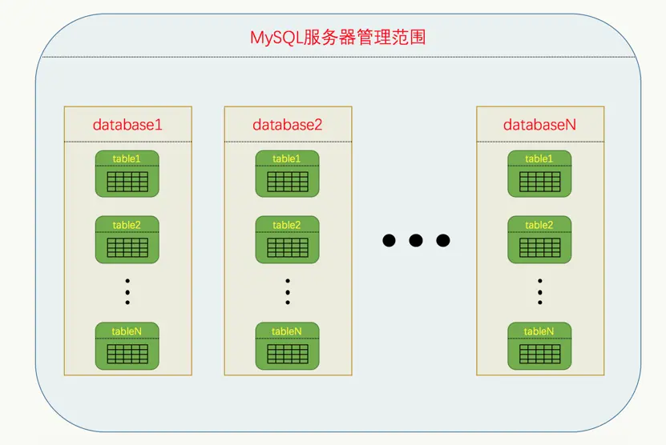

# 数据库的基本操作

> 在 MySQL 服务器中，我们把一些表的集合称为一个 **数据库**，MySQL 服务器管理着若干个数据库，每个数据库下都可以有若干个表，画个图就是这样：



我们在启动 MySQL 服务并且登录账户后想要看看，当前都有哪些数据库

``` shell
SHOW DATABASES
```
## 创建数据库

``` shell
CREATE DATABASE 数据库名;
```

如果是一个已经存在的数据库，我们去 CREATE 的话会报错，这个时候需要我们一个命令来兜底

> 意思是如果指定的数据库不存在的话就创建它，否则什么都不做

``` shell
CREATE DATABASE IF NOT EXISTS 数据库名;
```

## 切换当前数据库

**我们在连接到 MySQL 客户端后，都有一个当前数据库的概念，我们创建的表都会放到当前数据库中**

当我们想要看看自己目前所在的数据库是哪个的时候，可以使用下面的命令

``` shell
SELECT DATABASE();
```

运行这个命令后，你会看到当前选中的数据库名称或者 NULL（如果没有选中数据库）。

这个时候我们在切换或者选择数据库的时候就需要用到命令

``` shell
use 数据库名;
```

看到显示了**Database changed**说明当前数据库已经切换成功了

## 删除数据库

当我们觉得某个数据库不在需要的时候，我们将这个数据删掉，命令如下

``` shell
DROP DATABASE 数据库名;
```

**删除数据库意味着里边的表就都被删除了，也就意味着你的数据都没了，所以是个极其危险的操作，使用时需要极其谨慎**

不过我们可以把刚才创建测试用的数据库删掉

``` shell
DROP DATABASE xudong;
```

> 有一点需要注意，当我们删掉的数据库是**当前数据库**时，删除完成后，当前数据库会变为 NULL，需要我们重新选择
