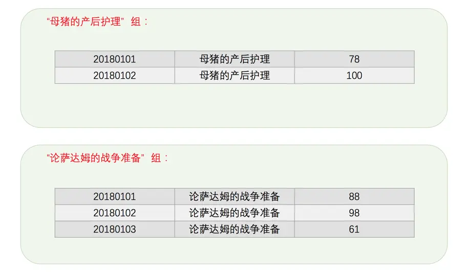
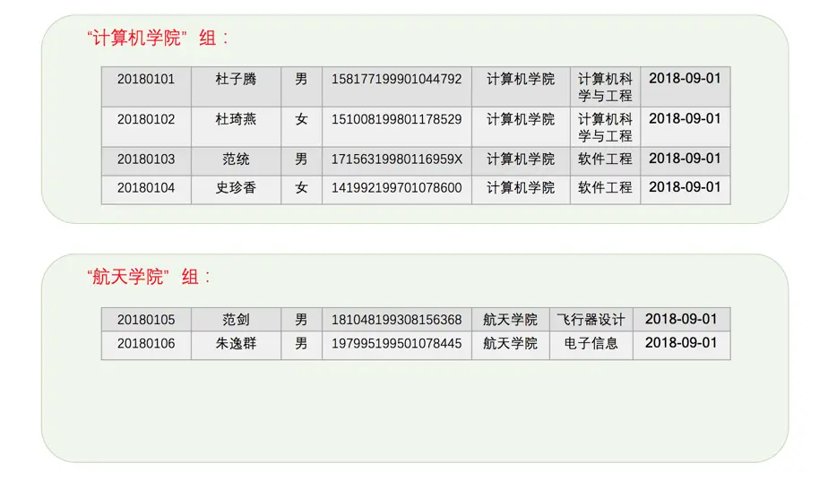
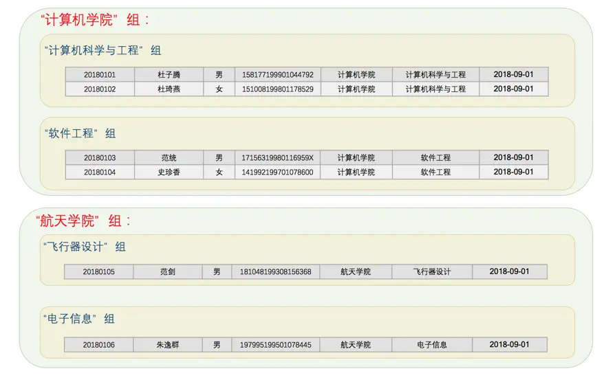

# 分组查询

## 复杂的数据统计

前边介绍了一些用来统计数据的聚集函数，我们可以方便的使用这些函数来统计出某列数据的行数、最大值、最小值、平均值以及整列数据的和。但是有些统计是比较麻烦的，比如说老师想根据成绩表分别统计出'母猪的产后护理'和'论萨达姆的战争准备'这两门课的平均分，那我们需要下边两个查询：

``` sql
SELECT AVG(score) FROM student_score WHERE subject = '母猪的产后护理';

SELECT AVG(score) FROM student_score WHERE subject = '论萨达姆的战争准备';
```

## 创建分组

如果课程增加到20门怎么办呢？我们一共需要写20个查询语句，这样神烦哎。为了在一条查询语句中就完成这20条语句的任务，所以引入了分组的概念，就是：针对某个列，将该列的值相同的记录分到一个组中。拿subject列来说，按照subject列分组的意思就是将subject列的值是'母猪的产后护理'的记录划分到一个组中，将subject列的值是'论萨达姆的战争准备'的记录划分到另一个组中，如果subject列还有别的值，则划分更多的组。其中分组依靠的列我们可以称之为分组列。所以在student_score表中按照subject列分组后的图示就是这样：


subject 列中有多少不重复的课程，那就会有多少个分组。幸运的是，只要我们在 GROUP BY 子句中添加上分组列就好了，MySQL 会帮助我们自动建立分组来方便我们统计信息，具体语句如下：

``` sql
SELECT subject, AVG(score) FROM student_score GROUP BY subject;
```

这个查询的执行过程就是按照 subject 中的值将所有的记录分成两组，然后分别对每个分组中记录的 score 列调用AVG函数进行数据统计。

在使用分组的时候必须要意识到，分组的存在仅仅是为了方便我们分别统计各个分组中的信息，所以我们只需要把分组列和聚集函数放到查询列表处就好！当然，如果非分组列出现在查询列表中会出现什么情况呢？比如下边这个查询：

``` sql
SELECT number, subject, AVG(score) FROM student_score GROUP BY subject;
```

可以看到出现了错误。为啥会错误呢？回想一下我们使用 GROUP BY 子句的初衷，我们只是想把记录分为若干组，然后再对各个组分别调用聚集函数去做一些统计工作。本例中的查询列表处放置了既非分组列、又非聚集函数的 number 列，那我们想表达啥意思呢？从各个分组中的记录中取一条记录的number列？该取分组中的哪条记录为好呢？比方说对于'母猪的产后护理'这个分组中的记录来说，该分组中有4条记录，那number列的值应该取20180101，还是20180102，还是20180103，还是20180104呢？这个我们也不知道，也就是说把非分组列放到查询列表中会引起争议，导致结果不确定。基于此，设计MySQL的大叔才会为上述语句报错。

> 其实假如分组后的每个分组的所有记录的某个非分组列的值都一样，那我把该非分组列加入到查询列表中也没啥问题呀。比方说按照subject列进行分组后，假如在'母猪的产后护理'的分组中各条记录的number列的值都相同，在'论萨达姆的战争准备'的分组中各条记录的number列的值也都相同，那么我们把number列放在查询列表中也没啥问题。可能设计MySQL的大叔觉得这种说法也有点儿道理，他们提出了一个称之为ONLY_FULL_GROUP_BY的SQL模式，当我们关闭这个SQL模式时，就允许把非分组列放到查询列表中。当然，什么是SQL模式，怎么开启和关闭这个称之为ONLY_FULL_GROUP_BY的SQL模式，不是我们初学者要考虑的问题，等以后大家变牛的时候可以再到文档中去查看。


## 带有WHERE子句的分组查询

上边的例子是将表中每条记录都划分到某个分组中，我们也可以在划分分组的时候就将某些记录过滤掉，这时就需要使用 WHERE 子句了。比如老师觉得各个科目的平均分太低了，所以想先把分数低于60分的记录去掉之后再统计平均分，就可以这么写：

``` sql
SELECT subject, AVG(score) FROM student_score WHERE score >= 60 GROUP BY subject;
```

这个过程可以分成两个步骤理解：

1. 将记录进行过滤后分组。

  在进行分组的时候将过滤掉不符合WHERE子句的记录，所以，最后的分组情况其实是这样的（少于60分的记录被过滤掉了）：

  

2. 分别对各个分组进行数据统计。

  统计之后就产生了上述的结果。

## 作用于分组的过滤条件

有时候某个带有 GROUP BY 子句的查询中可能会产生非常多的分组，假设 student_score 表中存储了 100 门学科的成绩，也就是 subject 列中有100个不重复的值，那就会产生100个分组，也就意味着这个查询的结果集中会产生100条记录。如果我们不想在结果集中得到这么多记录，只想把那些符合某些条件的分组加入到结果集，从而减少结果集中记录的条数，那就需要把针对分组的条件放到HAVING子句了。比方说老师想要查询平均分大于73分的课程，就可以这么写：

``` sql
SELECT subject, AVG(score) FROM student_score GROUP BY subject HAVING AVG(score) > 73;
```

其实这里所谓的针对分组的条件一般是指下边这两种：

1. 分组列

  也就是说我们可以把用于分组的列放到 HAVING 子句的条件中，比如这样：

  ``` sql
  SELECT subject, AVG(score) FROM student_score GROUP BY subject having subject = '母猪的产后护理';
  ```

2. 作用于分组的聚集函数

  当然，并不是HAVING子句中只能放置在查询列表出现的那些聚集函数，只要是针对这个分组进行统计的聚集函数都可以，比方说老师想查询最高分大于98分的课程的平均分，可以这么写：

  ``` sql
  SELECT subject, AVG(score) FROM student_score GROUP BY subject HAVING MAX(score) > 98;
  ```

  其中的MAX(score)这个聚集函数并没有出现在查询列表中，但仍然可以作为HAVING子句中表达式的一部分。

## 分组和排序

如果我们想对各个分组查询出来的统计数据进行排序，需要为查询列表中有聚集函数的表达式添加别名，比如想按照各个学科的平均分从大到小降序排序，可以这么写：

``` sql
SELECT subject, AVG(score) AS avg_score FROM student_score GROUP BY subject ORDER BY avg_score DESC;
```

## 嵌套分组

有时候按照某个列进行分组太笼统，一个分组内可以被继续划分成更小的分组。比方说对于student_info表来说，我们可以先按照department来进行分组，所以可以被划分为2个分组：



我们觉得这样按照 department 分组后，各个分组可以再按照 major 来继续分组，从而划分成更小的分组，所以再次分组之后的样子就是这样：



所以现在有了2个大分组，4个小分组，我们把这种对大的分组下继续分组的的情形叫做嵌套分组，如果你乐意，你可以继续把小分组划分成更小的分组。我们只需要在GROUP BY子句中把各个分组列依次写上，用逗号,分隔开就好了。比如这样：

``` sql
SELECT department, major, COUNT(*) FROM student_info GROUP BY department, major;
```

可以看到，在嵌套分组中，聚集函数将作用在最后一个分组列上，在这个例子中就是major列。

## 使用分组注意事项

使用分组来统计数据给我们带来了非常大的便利，但是要随时提防有坑的地方：

1. 如果分组列中含有NULL值，那么NULL也会作为一个独立的分组存在。
2. 如果存在多个分组列，也就是嵌套分组，聚集函数将作用在最后的那个分组列上。
3. 如果查询语句中存在WHERE子句和ORDER BY子句，那么GROUP BY子句必须出现在WHERE子句之后，ORDER BY子句之前。
4. 非分组列不能单独出现在检索列表中(可以被放到聚集函数中)。
5. GROUP BY子句后也可以跟随表达式(但不能是聚集函数)。

  上边介绍的GROUP BY后跟随的都是表中的某个列或者某些列，其实一个表达式也可以，比如这样：

  ``` sql
  SELECT concat('专业：', major), COUNT(*) FROM student_info GROUP BY concat('专业：', major);
  ```

  MySQL会根据这个表达式的值来对记录进行分组，使用表达式进行分组的时候需要特别注意，查询列表中的表达式和GROUP BY子句中的表达式必须完全一样。不过一般情况下我们也不会用表达式进行分组，所以目前基本没啥用～
6. WHERE子句和HAVING子句的区别。

  WHERE子句在分组前进行过滤，作用于每一条记录，WHERE子句过滤掉的记录将不包括在分组中。而HAVING子句在数据分组后进行过滤，作用于整个分组。

## 简单查询语句中各子句的顺序

我们上边介绍了查询语句的各个子句，但是除了SELECT之外，其他的子句全都是可以省略的。如果在一个查询语句中出现了多个子句，那么它们之间的顺序是不能乱放的，顺序如下所示：

``` shell
SELECT [DISTINCT] 查询列表
[FROM 表名]
[WHERE 布尔表达式]
[GROUP BY 分组列表 ]
[HAVING 分组过滤条件]
[ORDER BY 排序列表]
[LIMIT 开始行, 限制条数]
```

其中中括号[]中的内容表示可以省略，我们在书写查询语句的时候各个子句必须严格遵守这个顺序，不然会报错的！
