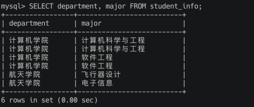

# 简单查询

## 准备工作

查询之前我们先给我们之前的 student_info 和 student_score 表创建几条数据

``` shell
INSERT INTO student_info (number, name, sex, id_card, department, major, enrollment_time) VALUES
-> (20180101, '杜子腾', '男', '158177199901044792', '计算机学院', '计算机科学与工程', '2018-09-01'),
-> (20180102, '杜琦燕', '女', '151008199801178529', '计算机学院', '计算机科学与工程', '2018-09-01'),
-> (20180103, '范统', '男', '17156319980116959X', '计算机学院', '软件工程', '2018-09-01'),
-> (20180104, '史珍香', '女', '141992199701078600', '计算机学院', '软件工程', '2018-09-01'),
-> (20180105, '范剑', '男', '181048199308156368', '航天学院', '飞行器设计', '2018-09-01'),
-> (20180106, '朱逸群', '男', '197995199501078445', '航天学院', '电子信息', '2018-09-01');

INSERT INTO student_score (number, subject, score) VALUES
-> (20180101, '母猪的产后护理', 78),
-> (20180101, '论萨达姆的战争准备', 88),
-> (20180102, '母猪的产后护理', 100),
-> (20180102, '论萨达姆的战争准备', 98),
-> (20180103, '母猪的产后护理', 59),
-> (20180103, '论萨达姆的战争准备', 61),
-> (20180104, '母猪的产后护理', 55),
-> (20180104, '论萨达姆的战争准备', 46);
```

表填完了，我们就开始查询吧

## 查询单个列

查看某个表中的某一列的数据的通用格式是这样：

``` shell
SELECT 列名 FROM 表名;
```

也就是说把需要查询的列名放到单词 SELECT 后边就好了，比如查看 student_info 表中的 number 列的数据可以这么写：

``` shell
SELECT number FROM student_info;
```

可以看到查询结构中就把所有记录的 number 列都展示了出来，我们有时候也把这个结果称之为结果集。

### 列的别名

我们也可以为结果集中的列重新定义一个别名，命令格式如下：

``` shell
SELECT 列名 [AS] 列的别名 FROM 表名;
```

我们看到 AS 被加了个中括号，意味着可有可无，没有 AS 的话，列名和列的别名之间用空白字符隔开就好了。比如我们想给 number 列起个别名，可以使用下边这两种方式之一：

1. 方式一：

```shell
SELECT number AS 学号 FROM student_info;
```

2. 方式二：

``` shell
SELECT number 学号 FROM student_info;
```

不过需要注意的是：别名只是在本次查询的到的结果集中展示，而不会改变真实表中的列名。下一次查询中你对 number 列取其他的别名也可以。

## 查询多个列

如果想查询多个列的数据，可以在SELECT后边写多个列名，用逗号,分隔开就好：

``` shell
SELECT 列名1, 列名2, ... 列名n FROM 表名;
```

我们把 SELECT 语句后边跟随的多个列统称为查询列表，需要注意的是，查询列表中的列名可以按任意顺序摆放，结果集将按照我们指定的列名顺序显示。

如果你乐意，同一个列可以在查询列表处重复出现（虽然这通常没什么卵用）

## 查询所有列

如果需要把记录中的所有列都查出来，MySQL也提供一个省事儿的办法，我们之前也介绍过，就是直接用星号*来表示要查询的东西，就像这样：

``` shell
SELECT * FORM 表名
```

> 这个命令我们之前看过了，就不多唠叨了。不过需要注意的是，除非你确实需要表中的每个列，否则一般最好别使用星号*来查询所有列，虽然星号*看起来很方便，不用明确列出所需的列，但是查询不需要的列通常会降低性能。

## 查询结果去重

### 去除单列的重复结果

有的时候我们查询某个列的数据时会有一些重复的结果，比如我们查询一下 student_info 表的学院信息：

``` shell
SELECT department FROM student_info;
```


因为表里有6条记录，所以给我们返回了6条结果。但是其实好多都是重复的结果，如果我们想去除重复结果的话，可以将 **DISTINCT** 放在被查询的列前边，就是这样：

``` shell
SELECT DISTINCT 列名 FROM 表名
```

我们对学院信息做一下去重处理：

``` shell
SELECT DISTINCT department FROM student_info;
```


看到结果集中就只剩下不重复的信息了。

### 去除多列的重复结果

对于查询多列的情况，两条结果重复的意思是：两条结果的每一个列中的值都相同。比如查询学院和专业信息：

``` shell
SELECT department, major FROM student_info;
```


查询结果中第1、2行记录中的 department 和 major 列都相同，所以这两条记录就是重复的，同理，第3、4行也是重复的。如果我们想对多列查询的结果去重的话，可以直接把 **DISTINCT** 放在被查询的列的最前边：

``` shell
SELECT DISTINCT 列名1, 列名2, ... 列名n  FROM 表名;
```

比如这样：

``` shell
SELECT DISTINCT department, major FROM student_info;
```


## 限制查询结果条数

有时候查询结果的条数会很多，都显示出来可能会撑爆屏幕～ 所以 MySQL 给我们提供了一种限制结果集中的记录条数的方式，就是在查询语句的末尾使用这样的语法：

``` shell
LIMIT 开始行, 限制条数;
```

开始行指的是我们想从第几行数据开始查询，限制条数是结果集中最多包含多少条记录。

比如我们查询一下 student_info 表，从第 0 条记录开始，最多查询 2 条记录可以这么写：

``` shell
SELECT * FROM student_info LIMIT 0, 2;
```

> 如果指定的开始行大于结果中的行数，那查询结果就什么都没有。
> 如果查询的结果条数不超过限制条数，那就可以全部显式出来。

### 使用默认的开始行

LIMIT 后边也可以只有一个参数，那这个参数就代表着限制行数。也就是说我们可以不指定开始行，默认的开始行就是第0行，比如我们可以这么写：

``` shell
SELECT * FROM student_info LIMIT 3;
```

查询结果就展示了从第0条开始的3条记录。

## 对查询结果排序

我们之前查询 number 列的时候得到的记录并不是有序的，这是为什么呢？MySQL 其实默认会按照这些数据底层存储的顺序来给我们返回数据，但是这些数据可能会经过更新或者删除，如果我们不明确指定按照什么顺序来排序返回结果的话，那我们可以认为该结果中记录的顺序是不确定的。换句话说如果我们想让返回结果中的记录按照某种特定的规则排序，那我们必须显式的指定排序规则。

### 按照单个列的值进行排序

我们可以用下边的语法来指定返回结果的记录按照某一列的值进行排序：

``` shell
ORDER BY 列名 ASC|DESC
```

ASC 和 DESC 指的是排序方向。ASC 是指按照指定列的值进行由小到大进行排序，也叫做升序，DESC 是指按照指定列的值进行由大到小进行排序，也叫做降序，中间的|表示这两种方式只能选一个。这回我们用student_score 表测试一下：

``` shell
SELECT * FROM student_score ORDER BY SCORE ASC;
```

可以看到输出的记录就是按照成绩由小到大进行排序的。如果省略了 ORDER BY 语句中的排序方向，则默认按照从小到大的顺序进行排序，也就是说 **ORDER BY 列名**和 **ORDER BY 列名 ASC** 的语义是一样的

### 按照多个列的值进行排序

我们也可以同时指定多个排序的列，多个排序列之间用逗号,隔开就好了，就是这样：

``` shell
ORDER BY 列1 ASC|DESC, 列2 ASC|DESC ...
```

比如我们想让对 student_score 的查询结果先按照 subjuect 排序，再按照 score 值从大到小的顺序进行排列，可以这么写：

``` shell
SELECT * FROM student_score ORDER BY subject ASC, score DESC;
```

**再提醒一遍，如果不指定排序方向，则默认使用的是ASC，也就是从小到大的升序规则。**

我们还可以让ORDER BY语句和LIMIT语句结合使用，不过 ORDER BY 语句必须放在 LIMIT 语句前边，比如这样：

``` shell
SELECT * FROM student_score ORDER BY score LIMIT 1;
```

这样就能找出成绩最低的那条记录了。
