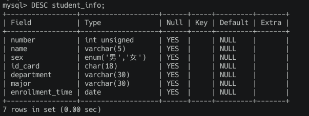
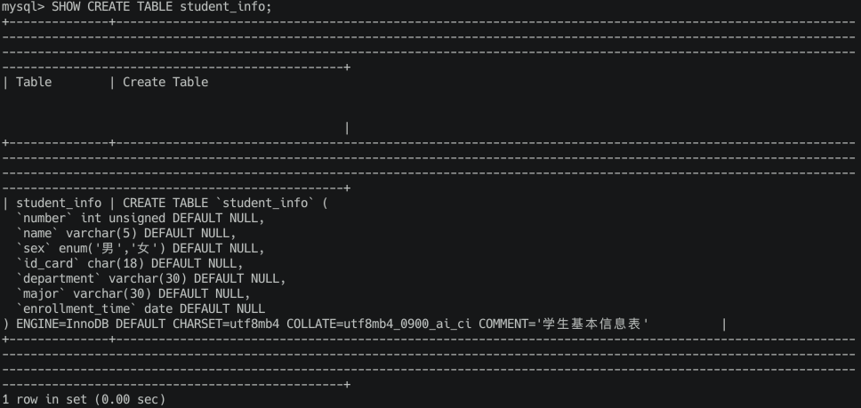
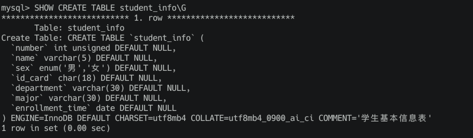

# 表的基本操作

## 展示当前数据库中的表

``` shell
SHOW TABLES;
```

可以看到结果就是 **Empty set**，因为我们还没有对这个新的数据库建表

## 创建表

### 基本语法

创建一个表时至少需要完成下列事情：

* 给表起个名。
* 给表定义一些列，并且给这些列都起个名。
* 每一个列都需要定义一种数据类型。
* 如果有需要的话，可以给这些列定义一些列的属性，比如不许存储NULL，设置默认值等等，具体列可以设置哪些属性我们稍后详细唠叨。

具体来说就是下面这样的

``` shell
CREATE TABLE 表名 (
  列名1    数据类型    [列的属性],
  列名2    数据类型    [列的属性],
  ...
  列名n    数据类型    [列的属性]
);
```

我们来创建一个表试试

``` shell
CREATE TABLE first_table (
  first_column INT,
  second_column VARCHAR(100)
);
```

### 建表的时候我们可以添加一些注释

``` shell
CREATE TABLE first_table (
  first_column INT,
  second_column VARCHAR(100)
) COMMENT '这是第一张表的注释';
```

因为我们之前创建过 first_table 这张表了，所以直接在创建会报错，所以我们继续用到了 IF NOT EXISTS 关键字，这样就不会报错了。

``` shell
CREATE TABLE IF NOT EXISTS first_table (
  first_column INT,
  second_column VARCHAR(100)
) COMMENT '这是第一张表的注释';
```

### 现在我们来创建一个有业务意义的表

就以学生信息为主，建一张学生信息的表

``` shell
CREATE TABLE student_info (
  number INT UNSIGNED,
  name VARCHAR(5),
  sex ENUM('男', '女'),
  id_card CHAR(18),
  department VARCHAR(30),
  major VARCHAR(30),
  enrollment_time DATE
) COMMENT '学生基本信息表';
```

在来一张学生成绩单的表

``` shell
CREATE TABLE student_score (
  number INT,
  subject VARCHAR(30),
  score TINYINT UNSIGNED
) COMMENT '学生成绩单';
```

## 删除表

当我们觉得某些表没有用的时候就可以删掉了，比如说刚才创建测试用的 first_table 表

先来看下删除的语法

``` shell
DROP TABLE 表1, 表2, ..., 表n;
```

我们来删除 first_table 表

``` shell
DROP TABLE first_table;
```

如果我们删除一个不存在的表会报错，这个时候又用到了我们的 EXISTS 关键字

``` shell
DROP TABLE IF EXISTS first_table;
```

## 查看表结构

有的时候我们创建过的表，忘记了表结构，需要我们回头看一看，也是可以的，下面这些命令效果是一样的

``` shell
DESCRIBE 表名;
DESC 表名;
EXPLAIN 表名;
SHOW COLUMNS FROM 表名;
SHOW FIELDS FROM 表名;
```

我们来看下 student_info 这张表的表结构

``` shell
DESC student_info;
```



这种表结构展示可能看不惯，并且没有表的注释信息，我们可以用下面这种命令

``` shell
SHOW CREATE TABLE student_info;
```



这种输出效果可能不是太好，我们可以将结束的 ; 改为 \G，以垂直的方式展示可能好点

``` shell
SHOW CREATE TABLE student_info\G
```



## 在没有选择当前数据库时对表的操作

> 在这部分教学之前我们首先退出当前数据库

**在 MySQL 中，一旦你使用 USE [数据库名] 命令选择了一个数据库，就没有直接的命令来“退出”或“取消选择”这个数据库。当你选择一个数据库后，它会一直是当前会话的默认数据库，直到你选择另一个数据库，或者会话结束。**

``` shell
exit;
```

哈哈  简单粗暴，我们退出后在重新登录下就可以了。

有时候我们并没有使用 USE 语句来选择当前数据库，或者在一条语句中遇到的表分散在不同的数据库中，如果我们想在语句中使用这些表，那么就必须显式的指定这些表所属的数据库了。比如不管当前数据库是不是 xudong，我们都可以调用这个语句来展示数据库 xudong 里边的表：

``` shell
SHOW TABLES FROM xudong;
```

其他地方如果使用到表名的话，需要显式指定这个表所属的数据库，指明方式是这样的：

``` shell
数据库名.表名
```

比方说我们想查看 xudong 数据库下 student_info 表的结构，但是又没有使用 USE xudong 语句指定当前数据库，此时可以这样写语句：

``` shell
SHOW CREATE TABLE xudong.student_info\G
```

## 修改表

在表创建好之后如果对表的结构不满意，比如想增加或者删除一列，想修改某一列的数据类型或者属性，想对表名或者列名进行重命名，这些操作统统都算是修改表结构。MySQL给我们提供了一系列修改表结构的语句。

### 修改表名

我们可以通过下边这两种方式来修改表的名称：

1. 方式一：

``` shell
ALTER TABLE 旧表名 RENAME TO 新表名;
```

我们来对 student_info 这张表操作一下

``` shell
ALTER TABLE xudong.student_info RENAME TO xudong.student_info1
```

> **我们还没有选择当前数据库，所以上面的表名前缀时数据库名**

2. 方式二：

``` shell
RENAME TABLE 旧表名1 TO 新表名1, 旧表名2 TO 新表名2, ... 旧表名n TO 新表名n;
```

这种改名方式的牛逼之处就是它可以在一条语句中修改多个表的名称。

如果在修改表名的时候指定了数据库名，还可以将该表转移到对应的数据库下.

我们把 新建的 first_table 表转移到这个新建的 xudong1 数据库下并且表名修改为 first_table1：

``` shell
RENAME TABLE xudong.first_table TO xudong1.first_table1;
```

### 增加列

我们可以使用下边的语句来增加表中的列：

``` shell
ALTER TABLE 表名 ADD COLUMN 列名 数据类型 [列的属性]
```

比如我们向 student_info 里添加一个名叫 parent 的列，用来记录学生的家长姓名，就可以这么写：

``` shell
ALTER TABLE student_info ADD COLUMN parent VARCHAR(5);
```

通过查看表的结构可以看到 parent 列已经添加成功了。

### 增加列到特定的位置

默认的情况下列都是加到现有列的最后一列后面，我们也可以在添加列的时候指定它的位置，常用的方式如下：

* 添加到第一列

``` shell
ALTER TABLE 表名 ADD COLUMN 列名 数据类型 [列属性] FIRST;
```

* 添加到指定列的后边：

``` shell
ALTER TABLE 表名 ADD COLUMN 列名 数据类型 [列属性] AFTER 已有的列名
```

### 删除列

我们可以使用下边的语句来删除表中的列：

``` shell
ALTER TABLE 表名 DROP COLUMN 列名
```

### 修改列信息

修改列的信息有下边这两种方式：

1. 方式一：

``` shell
ALTER TABLE 表名 MODIFY COLUMN 列名 数据类型 [列属性]
```

修改完成后，查看表结构信息，发现已经修改成功，不过在修改列信息的时候需要注意：**修改后的数据类型和属性一定要兼容表中现有的数据！**

2. 方式二：

``` shell
ALTER TABLE 表名 CHANGE 旧列名 新列名 新数据类型 [列属性]
```

可以看到这种修改方式需要我们填两个列名，也就是说在修改数据类型和属性的同时也可以修改列名！

### 修改列排列位置

如果我们觉得当前列的顺序有问题的话，可以使用下边这几条语句进行修改：

1. 将列设为表的第一列：

``` shell
ALTER TABLE 表名 MODIFY COLUMN 列名 数据类型 [列属性] FIRST;
```

2. 将列放到指定列的后边：

``` shell
ALTER TABLE 表名 MODIFY COLUMN 列名 数据类型 [列属性] AFTER 已有的列名;
```

## 一条语句中可以包含多个修改操作

如果对同一个表有多个修改操作的话，我们可以把它们放到一条语句中执行，就像这样：

``` shell
ALTER TABLE 表名 操作1, 操作2, ..., 操作n;
```

比如在删除列操作的时候，如果有连续删除列，可以合并为一条，比如下面这种

``` shell
ALTER TABLE 表名 DROP COLUMN 列1, DROP COLUMN 列2, DROP COLUMN 列3;
```
