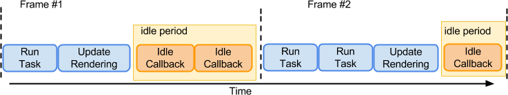
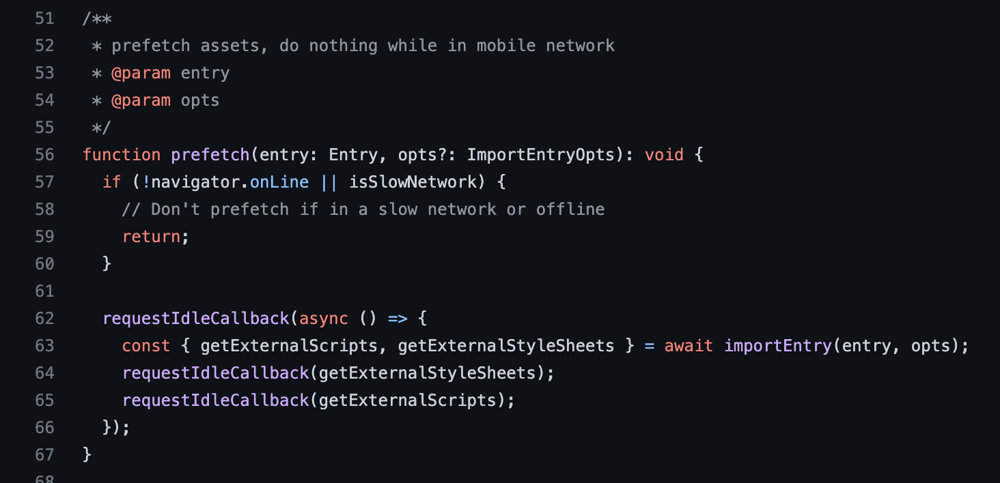

# RequestIdleCallback 详解

## 什么是RequestIdleCallback

requestIdleCallback 是一个还在[实验中的 api](https://developer.mozilla.org/zh-CN/docs/Web/API/Window/requestIdleCallback)，可以让我们在浏览器空闲的时候做一些事情。
先来看下它的简单用法，大家可以直接复制下面的代码在控制台中执行。

``` js
/**
	deadline上面有一个timeRemaining()方法，
 	能够获取当前浏览器的剩余空闲时间，单位 ms；
  有一个属性 didTimeout，表示是否超时
*/
function work(deadline) {
  console.log(`当前帧剩余时间: ${deadline.timeRemaining()}`);
  if (deadline.timeRemaining() > 0 || deadline.didTimeout) {
     // 走到这里，说明时间有余，我们就可以在这里写自己的代码逻辑
  }
  // 走到这里，说明时间不够了，就让出控制权给主线程，下次空闲时继续调用
  requestIdleCallback(work);
}
// 这边可以传一个回调函数（必传）和参数（目前就只有超时这一个参数）
requestIdleCallback(work, { timeout: 1000 });
```

如果你运行了并且页面没有什么操作的话，打印出来的时间大部分会是在 49.9ms 左右；如果你稍微晃几下鼠标，打印出来的时间大部分会小于 16ms，因为此时浏览器不空闲了。

## 模拟调度方法

``` js
/**
  此函数运用了while阻塞的特性
  for循环也能实现阻塞功能，不过性能消耗相比较大
  while和for循环不同点在于，for循环在开始前就知道会循环多少次
  while循环是不知道要循环多少次 但是最后会停下来 设置了最后的终止条件
*/
function sleep(duration) {
  let start = Date.now();
  while (start + duration > Date.now()) {

  }
}

// 一个任务队列
let tasks = [
  function t1() {
    console.log('执行任务1')
    sleep(20);
    console.log('结束任务1')
  },
  function t2() {
    console.log('执行任务2')
    sleep(20);
    console.log('结束任务2')
  },
  function t3() {
    console.log('执行任务3')
    sleep(20);
    console.log('结束任务3')
  },
]

// deadline是requestIdleCallback返回的一个对象
function myWork(deadline) {
  console.log(`当前帧剩余时间: ${deadline.timeRemaining()}`)
  // 查看当前帧的剩余时间是否大于0 && 是否还有剩余任务
  if (deadline.timeRemaining() > 0 && tasks.length) {
    // 在这里做一些事情
    const task = tasks.shift()
    task();
  }
  // 如果还有任务没有被执行，那就放到下一帧调度中去继续执行，类似递归
  if (tasks.length) {
    console.log(`当前帧剩剩余: ${deadline.timeRemaining()} 下次执行`)

    requestIdleCallback(myWork);
  }
}

requestIdleCallback(myWork);
```

## [什么是空闲时间](https://w3c.github.io/requestidlecallback/)

我们知道页面是一帧一帧绘制出来的，一般情况下每秒 60 帧对我们来说就是流畅的，相对应的每帧时间大概是 16ms，所以如果每帧要执行的东西（task + render + ...）的时间小于 16ms，就说明有空闲时间可以利用，如下图所示



所以我们可以看到一开始的实验中，不操作页面大概率会打印 49.9 ms，动动鼠标就会小于 16 ms。 那为啥是 50ms 呢？简单理解就是这是一个经验值或者统计值，因为如果空闲时间给的太长，期间如果有高优任务（如键盘事件）产生，就不能够很好的响应，可能会感觉到一丢丢延迟。

## 可以用这个来做什么事情呢 :exploding_head:

### 数据的分析和上报

* 在用户有操作行为时（如点击按钮、滚动页面）进行数据分析并上报。
* 处理数据时往往会调用 JSON.stringify ，如果数据量较大，可能会有性能问题。 此时我们就可以使用 requestIdleCallback 调度上报时机，避免上报阻塞页面渲染，下面是简单的代码示例。

``` js
const queues = [];

const btns = btns.forEach(btn => {
  btn.addEventListener('click', e => {
    // do something
    pushQueue({
      type: 'click'
      // ...
    }));
    schedule();
  });
});

function schedule() {
  requestIdleCallback(deadline => {
    while (deadline.timeRemaining() > 0) {
        const data = queues.shift();
        // 这里就可以处理数据、上传数据
    }
    if (queues.length) {
      schedule();
    }
  });
}
```

### 预加载

这个就比较好理解了，在空闲的时候加载些东西，可以看看 qiankun 的例子（polify的来源），用来预加载 js 和 css，如下图所示：



### 检测卡顿（尚未实践）

* 测量 fps 值，如果连续出现几个 fps 值 ≤ 阈值，则认为是卡顿
* 开辟一个 worker 线程和主线程之间来个心跳检测，一段时间内没响应，则认为是卡顿 回过头来，如果 requestIdleCallback 长时间内没能得到执行，说明一直没有空闲时间，很有可能就是发生了卡顿，从而可以打点上报。它比较适用于行为卡顿，举个例子：点击某个按钮并同时添加我们的 requestIdleCallback 回调，如果点击后的一段时间内这个回调没有得到执行，很大概率是这个点击操作造成了卡顿。

### 拆分耗时任务（react的fiber）

这个思想在[React 中的调度器 Scheduler](https://github.com/facebook/react/blob/1fb18e22ae66fdb1dc127347e169e73948778e5a/packages/scheduler/src/Scheduler.js)里面展现的淋漓尽致，虽然 React自己实现了一套调度逻辑(兼容性、稳定性和优先级等原因)，不过不妨碍我们理解。 简单来说React把diff的过程从早前的递归变成了现在的迭代，对两个大对象进行递归diff就是个耗时的任务，如果能够拆解成小任务，那该有多好。但是递归又不能中途终止，所以 React采用了fiber这种数据结构，把递归变成了链表迭代，迭代就可以中途停止，我们就不用一次性diff完。

> 不懂链表的同学就简单理解成是数组吧，你想想如果我们要把数组进行遍历，我们可以一次性执行完，但是我们也可以拆成几次执行完，只要我们记录个 index，下次回来继续执行代码的时候就从 index 开始遍历就行，不知道大家 get 到木有。

## 简单模拟下RequestIdleCallback

可以大致分为两种方式模拟：

### setTimeout实现

首选大家要知道一个前提，为什么能够 setTimeout 来模拟，所以我们先简单看下下面这两行代码：

``` // 某种程度上功能相似，写法也相似
requestIdleCallback(() => console.log(1));
setTimeout(() => console.log(2));
```

了解过setTimeout的同学应该知道这个东西它不准，上面那样写并不是立刻执行的意思，而是尽可能快的执行，就是等待主线程为空，微任务也执行完了，那么就可以轮到setTimeout执行了，所以setTimeout(fn) 某种程度上讲也有空闲的意思，了解了这个点我们就可以用它来模拟啦，直接看下面的代码即可，就是在setTimeout里面多了个构造参数的步骤：

``` js
window.requestIdleCallback = function(cb) {
  let start = Date.now();
  return setTimeout(function () {
    const deadline = {
      timeRemaining: () => Math.max(0, 50 - (Date.now() - start)),
      didTimeout: false
    };
    cb(deadline);
  }, 1);
}
```

要注意的是，这个并不是requestIdleCallback的polyfill ，因为实际上它们并不相同。setTimeout 并不算是真正的利用空闲时间，而是在条件允许的情况下尽可能快的执行你的代码。上面的代码并不会像真正的 requestIdleCallback那样将自己限制在这一帧的空闲时间内，但是它达到了两个效果，一个是将任务分段，一个是控制每次执行的时间上限。一般满足这两个条件的就是宏任务了，所以除了setTimout外，postMessage也是可以实现的。接下来我们来看看模拟的另一种方法。

### 用 requestAnimationFrame + MessageChannel 实现

``` js
// 当前帧结束时间
let deadlineTime
// 需要回调的任务
let callback

// postMessage的一种，该对象实例有且只有两个端口，并且可以相互收发事件，当做是发布订阅即可。
let channel = new MessageChannel();
let port1 = channel.port1;
let port2 = channel.port2;

port2.onmessage = () => {
  const timeRemaining = () => deadlineTime - performance.now();
  if (timeRemaining() > 0 && callback) {
    const deadline = { timeRemaining, didTimeout: false }; // 同样的这里也是构造个参数
    callback(deadline);
  }
}

window.requestIdleCallback = function(cb) {
  requestAnimationFrame(rafStartTime => {
    // 大概过期时间 = 默认这是一帧的开始时间 + 一帧大概耗时
    deadlineTime = rafStartTime + 16
    callback = cb
    port1.postMessage(null);
  });
}
```

上面这种方式会比 setTimeout 稍好一些，因为 MessageChannel 的执行在 setTimeout 之前，并且没有 4ms 的最小延时。

那为什么不用微任务模拟呢？因为如果你用微任务模拟的话，在代码执行完之后，所有的微任务就会继续全部执行，不能及时的让出主线程。

ps：这两种方法都不是 polyfill，只是尽可能靠近 requestIdleCallback，并且剩余时间也是猜测的。

## 注意事项 :cold_face:

### 避免在回调中更改DOM

* 因为我们本来就是利用渲染后的时间，期间操作 dom 或者读取某些元素的布局属性大概率会造成重新渲染。
* 操作 dom 所带来的时间影响是不确定的，可能会导致重排重绘，所以这类操作是不可控的。
* requestIdleCallback不会和帧对齐（不应该期望每帧都会调用此回调），所以涉及到 dom 操作的话最好放在requestAnimationFrame 中执行，我们拿渲染十万条数据举个例子，就像下面这样：

``` html
<body>
  <div><button id="btn1">渲染十万条</button><input></div>
  <div><button id="btn2">requestIdleCallback 渲染十万条</button><input></div>
  <ul id="list1"></ul>
  <ul id="list2"></ul>
</body>

<script>
  // 方案一：无脑添加
  const NUM1 = 100000;
  let list1 = document.getElementById("list1");
  document.getElementById("btn1").addEventListener('click', bigInsert1);

  function bigInsert1() {
    let i = 0;
    while (i < NUM1) {
      let item = document.createElement("li");
      item.innerText = `第${i++}条数据`;
      list1.appendChild(item);
    }
  }

  // 方案二：时间切片
  const NUM2 = 100000
  let list2 = document.getElementById("list2");
  let f = document.createDocumentFragment();
  let i = 0;
  document.getElementById("btn2").addEventListener('click', () => {
    requestIdleCallback(bigInsert2);
  });
  function bigInsert2(deadline) {
    while (deadline.timeRemaining() > 0 && i < NUM2) {
      console.log('空闲执行中');
      let item = document.createElement("li");
      item.innerText = `第${i++}条数据`;
      f.appendChild(item);
      if (f.children.length >= 100) break; // 每次渲染 100 条
    }
    f.children.length && requestAnimationFrame(() => {
      list2.appendChild(f);
      f = document.createDocumentFragment();
    });
    if (i < NUM2) requestIdleCallback(bigInsert2)
  }
</script>
```

> [DocumentFragments](https://developer.mozilla.org/zh-CN/docs/Web/API/Document/createDocumentFragment)是 DOM 节点。它们不是主 DOM 树的一部分。通常的用例是创建文档片段，将元素附加到文档片段，然后将文档片段附加到 DOM 树。在 DOM 树中，文档片段被其所有的子元素所代替。
因为文档片段存在于内存中，并不在 DOM 树中，所以将子元素插入到文档片段时不会引起页面回流（对元素位置和几何上的计算）。因此，使用文档片段通常会带来更好的性能。

### 避免在回调中使用promise

因为 promise 的回调属于优先级较高的微任务，所以会在 requestIdleCallback 回调结束后立即执行，可能会给这一帧带来超时的风险。

### 在需要的时候再使用timeout

* 使用 timeout 参数可以保证你的代码按时执行，但是我们想想 requestIdleCallback 本来就是让你在空闲时间调用的，使用 timeout 就会有种我没空闲时间了，你还强行让我执行，和 requestIdleCallback 的初衷就会有点矛盾，所以最好是让浏览器自己决定何时调用。
* 另一方面检查超时也会产生一些额外开销，该 api 调用频率也会增加，大家可以复制下面的代码在控制台打印看看：

``` js
// 无超时，一般打印值为 49/50 ms
function work(deadline) {
  console.log(`当前帧剩余时间: ${deadline.timeRemaining()}`);
  requestIdleCallback(work);
}
requestIdleCallback(work);


// 有超时，打印值就不怎么固定了
function work(deadline) {
  console.log(`当前帧剩余时间: ${deadline.timeRemaining()}`);
  requestIdleCallback(work, { timeout: 1500 });
}
requestIdleCallback(work, { timeout: 1500 }); 
```
