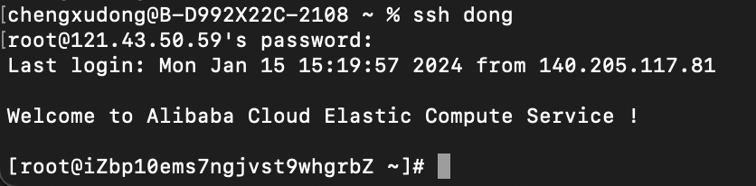
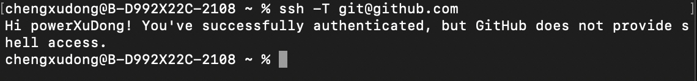

# ssh 的应用
我们平时在和 github 交互的时候，一般都是通过 https 的方式，但是这种方式每次都要输入用户名密码，比较麻烦。所以我们一般会使用 ssh

当然 作为程序员，我们每个人或多或少都有自己的服务器，无论是实体的还是 ECS 云服务器，我们平时链接自己的服务器也是使用 ssh

所以下面我们就来讲讲关于 ssh 链接的问题，并且有一些快捷操作大家也应该学会，方便我们平时的开发工作 :man_in_manual_wheelchair:

> 并且目前 github 早已经不在支持 https 的方式去访问了，所以我们需要使用 ssh 的方式来进行操作

此篇文章的主要内容是:
* ssh keygen 生成非对称加密中的 public-key 与 private-key
* 把 publik-key 扔到 github/云服务器 上

## 在没有设置密钥对的情况下 github/云服务器 是什么样的呢

### github
如果没有在 github 设置 public key 而直接执行 git clone 命令的话，会有权限问题。使用 ssh -T 测试连通性如下，会有一个 Permission denied 的异常，就像下面这样

``` shell
$ git clone git@github.com:vim/vim.git
Cloning into 'vim'...
Warning: Permanently added the RSA host key for IP address '13.229.188.59' to the list of known hosts.
Permission denied (publickey).
fatal: Could not read from remote repository.

Please make sure you have the correct access rights
and the repository exists.
```

我们可以通过 ssh -T 来更直接的看是否有 clone 权限

``` shell
$ ssh -T git@github.com
Permission denied (publickey).
```

### 云服务器
我们用 ssh 登录服务器

把以下 IP 地址替换为你云服务器的公网地址，并提供密码即可登录
``` shell
$ ssh root@121.43.50.59

// 当有域名并且解析后就可以用域名来登录
$ ssh root@www.chengxudong.com
```

但记住每一个 IP 地址或者域名，这是一个反人性的操作，如果你有多个服务器呢？此时 ssh-config 就派上了用场

#### 快速登录 ssh-config
在本地客户端环境 (个人电脑) 上配置 ssh-config，对个人服务器起别名，可以更方便地登录云服务器，以下是关于 ssh-config 的配置文件

```
~/.ssh/config
```

以下是快速登录我的两个服务器的不同账户 root 和 git 账户的配置

``` shell
Host dong
  HostName 121.43.50.59
  User root
  # 指定ssh的密钥文件   默认为 id_rsa 文件名称
  IdentityFile /Users/chengxudong/.ssh/id_rsa_dong

Host dongGit
  HostName 121.43.50.59
  User git
  # 指定ssh的密钥文件   默认为 id_rsa 文件名称
  IdentityFile /Users/chengxudong/.ssh/id_rsa_dong
```

配置成功之后直接 ssh host 名称就可以，是不是很方便呢？


不过登录时还是需要输入账户密码的，接下来我们来讲解一下免密登录

## 免密登录及 github 通过密钥对进行 clone 代码

### 生成一个密钥对

使用命令 ssh-keygen 可以生成配对的 id_rsa 与 id_rsa.pub 文件，生成之后只需把 id_rsa.pub（公钥） 扔到 github/云服务器 即可

``` shell
# 生成一个 ssh-key
# -t: 可选择 dsa | ecdsa | ed25519 | rsa | rsa1，代表加密方式
# -C: 注释，一般写自己的邮箱
$ ssh-keygen -t rsa -C "dong@163.com"
```
在这里命令输入后，如果不想要默认的 id_rsa 文件名，可以输入自己指定文件名，比如我的 github 的密钥对就叫 id_rsa_github，而我的云服务器的密钥对就叫 id_rsa_dong

> 每次生成密钥，看到国内的博客都要求输入邮箱，但并不知道意义何在
> 其实邮箱仅仅是识别用的 key
> 所以这个注释你可以输入任何内容，很多网站和软件用这个注释作为密钥的名字

### github 中放置公钥
复制 ~/.ssh/id_rsa_github.pub 中文件内容，并粘贴到github 的配置中。

github 的 ssh keys 设置
[点击这里设置](https://github.com/settings/keys)
点击页面中的 New SSH key 添加刚才生成的 public key

可以参照[官方文档](https://help.github.com/cn/articles/adding-a-new-ssh-key-to-your-github-account)

因为我们的私钥文件名称不是默认的 id_rsa 名称，所以需要我们在 ssh-config 中对 gihub 这里也做一个配置

``` shell
Host github.com
  HostName github.com
  User git
  IdentityFile /Users/chengxudong/.ssh/id_rsa_github
```

使用 ssh -T 来测试一下


### 云服务器中放置公钥
如何实现远程服务器的免密登录

* 两个文件: 本地环境的 ~/.ssh/id_rsa_dong.pub 与 远程服务器的 ~/.ssh/authorized_keys
* 一个动作：把本地文件中的内容复制粘贴到远程服务器中

总结成一句话，即把自己的公钥放在远程服务器

简单来说，就是 Ctrl-C 与 Ctrl-V 操作，不过具体实施起来较为琐碎，更为重要的是对于新人还有一个门槛：vim 的使用

此时一个解决生产力的命令行工具应运而生: ssh-copy-id

``` shell
# 在本地环境进行操作

# 提示你输入密码，成功之后可以直接 ssh 登录，无需密码
$ ssh-copy-id -i ~/.ssh/id_rsa_dong.pub root@121.43.50.59

# 登陆成功，无需密码
$ ssh dong
```

> ssh-copy-id 命令可以自动把本地主机的公钥复制到远程主机的 authorized_keys 文件上，找到 /root/.ssh/authorized_keys文件，将刚刚复制的内容，添加到该文件的末尾
> 需要注意的是，同一个服务器，不同的账户都需要公钥配置

#### 服务器设置禁用密码登录
为了更大保障服务器的安全性，这里禁止密码登录

修改云服务器的 sshd 配置文件：/etc/ssh/sshd_config，其中 PasswordAuthentication 设置为 no，以此来禁用密码登录

``` shell
# 编辑服务器端的 /etc/ssh/sshd_config
# 禁用密码登录
Host *
  PasswordAuthentication no
```
